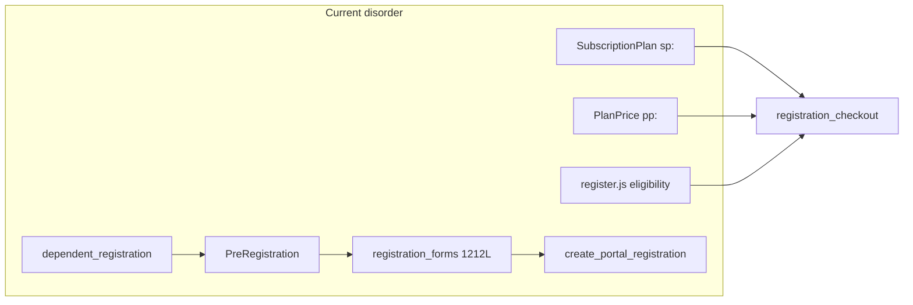

# PRD-138: Architectural Audit — Single Flow and MVP Consistency

## Summary

Complete read-only audit of the LV JIU JITSU codebase (Jul/2026), covering the
domain backend (`models`, `forms`, `services`, `selectors`), HTTP layer (`views`,
URLs, tests, commands), UI (`templates`, `static`), and documentation governance.
The system **does not currently have a single consistent flow**: a dual plan
catalog, three registration paths, triplicated business rules
(form/service/JS), 61 temporary Portuguese redirects, 4 orphaned views, 4 dead
functions, and documentation contradicting the code coexist. No template or
asset under `static/system/` is orphaned; the disorder lies in **parallel flows
and god modules**.

## Demand type

Full architectural review (read-only) + consolidation routing. **Does not
implement code** — defines the inventory, classification, priorities, and
execution PRDs.

## Current problem

### Cross-cutting diagnosis (3 audit fronts)

| Dimension | Metric | Main finding |
|---|---|---|
| Domain backend | 87 files | ~40% ACTIVE_INCONSISTENT / LEGACY / DUPLICATION |
| HTTP | ~128 views, 100 named routes | 4 orphaned views; 61 PT redirects; fat views (home 733L) |
| UI | 92 templates, 27 assets | 0 orphans; `register.js` 3700+ lines with business rules |
| Tests | 66 files | No obsolete tests for removed features; ~25 routes without direct HTTP coverage |
| Commands | 33 executable | 1 orphan (`seed_system_people_flow_samples`) |
| Docs | 138 PRDs | `UI-SCREEN-CONTRACT` cites nonexistent files; README skips PRD-101–110 |

### Critical disorder (top 5)

1. **Dual plan catalog** — `SubscriptionPlan` (legacy, `sp:` prefix) coexists
   with `PlanTier`/`PlanPrice` (new, `pp:`) in checkout, forms, admin, and
   memberships.
2. **Three registration paths** — `PreRegistration` wizard →
   `finalize_pre_registration` → `form.save()` → `create_portal_registration`
   (legacy); dependent through `dependent_registration`; validation in form +
   service + JS.
3. **Business rules in the frontend** — `register.js` and
   `dependent_registration.js` reimplement eligibility already present in
   `plan_eligibility.py`.
4. **God modules** — `registration_forms.py` (1212L),
   `registration_checkout.py` (979L), `class_calendar.py` (1533L),
   `home_views.py` (733L), `register.js` (3700+L).
5. **Fragmented visual shell** — no `lv/base.html`; inline theme boot on home,
   wizard, and plans; inconsistent `?v=` across screens.

## Goal

Establish an **architectural source of truth** to converge the MVP toward:

- one plan catalog (`PlanTier`/`PlanPrice`);
- one registration contract (snapshot → payment → `Person` materialisation);
- authoritative backend validation;
- a unified UI shell;
- incremental removal of proven legacy material (dead views/functions,
  Portuguese redirects, obsolete seeds).

## Context Ledger

### Files read in full

- `AGENTS.md`, `CLAUDE.md`, `docs/PRD-STANDARD.md`
- Complete read-only audit reports (Jul/2026):
  - Backend: `system/models/`, `forms/`, `services/`, `selectors/` (87 files)
  - HTTP: `system/views/`, `urls.py`, `system/tests/`, `management/commands/`
  - UI: `templates/`, `static/system/`, `docs/`

### Adjacent files consulted

- `docs/prd/README.md` (index through PRD-137)
- `docs/UI-SCREEN-CONTRACT.md`
- Related PRDs: 040, 076, 081, 097, 115, 127, 129, 130

### Internet / official documentation

- [Django MVT — separation of concerns](https://docs.djangoproject.com/en/5.2/misc/design-philosophies/#loose-coupling) — validation that business rules belong in services, not views/forms/JS.

### Context7 / MCPs / tools verified

- Read-only explore subagents (3 parallel fronts)
- `rg`, file inventory, route-view-template cross-reference

### Limitations found

- Read-only audit; no test run in this PRD.
- `staticfiles/` locally empty (collectstatic not evidenced).
- Per-file classification is heuristic (references + pattern); removal requires
  confirmation in an execution PRD.

## Required skills

- `lv-task-intake` (completed)
- `lv-prd` (this PRD)
- `lv-cleanup-audit` (for each child PRD)
- `lv-django-delivery` (backend execution)
- `lv-ui-delivery` (UI execution)

## Understanding approved

User request (Jul/2026): an unacceptable MVP/prototype with tangled
architecture and business rules; requires one consistent flow, a complete
review classifying every file, and a new PRD documenting everything.

## Execution prompt

### Persona

Django software architect focused on a single flow and evidence-based legacy
removal.

### Action

Execute prioritised consolidations (Plan section), one child PRD per wave,
without automatically expanding scope.

### Context

This PRD is the master map; implementation occurs in existing or new child
PRDs.

### Constraints

- Confirm references before removing any symbol.
- Do not declare the system clean until waves 1–3 are completed with evidence.
- Staging/production require explicit confirmation.

### Acceptance criteria

- [ ] Public catalog uses only `PlanTier`/`PlanPrice` (PRD-129/130/137)
- [ ] Registration finalisation no longer passes through legacy `create_portal_registration` (PRD-081)
- [ ] Plan eligibility comes from the backend; JS only renders (PRD-129)
- [ ] 4 orphaned views and 4 dead functions removed with green tests
- [ ] `UI-SCREEN-CONTRACT.md` aligned with the actual code
- [ ] Portuguese redirects removed or scheduled (PRD-078)

### Expected evidence

- `manage.py test system` after each wave
- `rg` with zero references to removed symbols
- Browser wizard + home on desktop/mobile after UI changes

### Output format

Child PRDs with checklists and actual evidence; this PRD updated with status by
wave.

## Scope

### Consolidated inventory and classification

#### Backend — `system/models/` (21 files)

| Classification | Files |
|---|---|
| ACTIVE_CONSISTENT | `common`, `pre_registration`, `registration_order`, `product*`, `calendar`, `graduation`, `category`, `class_*`, `request_workflows`, `asaas`, `coupon`, `trial_access`, `audit`, `membership_timeline` |
| ACTIVE_INCONSISTENT | `person` (imports service), `membership` (query in property), `class_membership` (rule in model) |
| LEGACY_REWRITE / DUPLICATION | **`plan.py`** — `SubscriptionPlan` + `PlanTier`/`PlanPrice`; `compute_gross_price` duplicates service |

#### Backend — `system/forms/` (14 files)

| Classification | Files |
|---|---|
| ACTIVE_CONSISTENT | `auth_forms`, `category_forms`, `class_forms`, `class_request_forms`, `graduation_forms`, `membership_pause_forms`, `plan_tier_forms`, `product_forms` |
| LEGACY_REWRITE | **`registration_forms.py`** (1212L, god form) |
| ACTIVE_INCONSISTENT / DUPLICATION | `dependent_forms` (654L, mirrors registration), `plan_forms` (legacy CRUD), `person_forms` (`save()` orchestrates domain), `access_request_forms` |

#### Backend — `system/services/` (47 files)

| Classification | Files |
|---|---|
| ACTIVE_CONSISTENT | Operational majority: `membership`, `plan_change`, `family_pricing`, `stripe_*`, `asaas_*`, `graduation`, `class_requests`, `payroll_rules`, `product_*`, `coupon`, `portal_*`, `membership_timeline*`, etc. |
| LEGACY_REWRITE | **`registration_checkout.py`** (979L, dual catalog), **`registration.py`** (legacy `create_portal_registration`) |
| ACTIVE_INCONSISTENT | `pre_registration` (legacy finalisation + 4 dead functions), `dependent_registration` (parallel flow), `plan_management` (legacy CRUD), `class_calendar` (1533L) |
| DUPLICATION | `registration_validation` vs `registration_forms.clean`; `class_overview` vs `class_catalog`; model pricing vs `financial_transactions` |
| DEAD_CODE (functions) | `pre_registration.py`: `create_or_update_pre_registration`, `build_form_snapshot`, `get_pre_registration_for_session`, `restore_form_initial` |

#### Backend — `system/selectors/` (5 files)

| Classification | Files |
|---|---|
| ACTIVE_CONSISTENT | `person_selectors`, `plan_eligibility`, `product_backorders` |
| ACTIVE_INCONSISTENT | `graduation` (N+1 in loop) |

#### HTTP — `system/views/` (~30 modules, ~128 classes)

| Classification | Examples |
|---|---|
| ACTIVE_CONSISTENT | Standard modal CRUDs (classes, graduation, products, person types) |
| DEAD_CODE (views without a route) | `RegistrationStepValidationView`, `RootRedirectView`, `StudentScheduleView`, `InstructorCalendarView` (aliases) |
| LEGACY_REWRITE / fat | `home_views` (733L), `person_views` (611L), `auth_views` (563L), `dependent_views` (444L), `calendar_views` (659L) |

#### HTTP — redirects and routes

| Item | Qty | Classification |
|---|---|---|
| Named EN routes | 100 | ACTIVE_CONSISTENT (canonical) |
| Unnamed PT redirects | 61 | LEGACY_REWRITE (PRD-078) |
| Routes without a direct HTTP test | ~25 | ACTIVE_INCONSISTENT (coverage gap) |

#### HTTP — `system/tests/` (66 files)

| Classification | Notes |
|---|---|
| ACTIVE_CONSISTENT | ~60 files aligned with the current flow |
| ACTIVE_INCONSISTENT | `test_family_pricing` (`LegacyPlanTierInteropTestCase`), `test_plan_change*`, `test_stripe_sync` (still use `SubscriptionPlan`) |
| DEAD_CODE | No test for a removed feature |

#### HTTP — `management/commands/` (34 files)

| Classification | Files |
|---|---|
| ACTIVE_CONSISTENT | Canonical seeds, `lock_supabase_api_access`, `generate_due_asaas_charges`, `backfill_membership_timeline`, staging/prod clears |
| LEGACY / OBSOLETE | `seed_system_initial_subscription_plans_stripe` (empty JSON) |
| ORPHAN | `seed_system_people_flow_samples` (PRD-070 only) |

#### UI — `templates/` (92 files)

| Classification | Approx. qty | Notes |
|---|---|---|
| ACTIVE_CONSISTENT | ~62 | Standard modal CRUD hubs |
| ACTIVE_INCONSISTENT | ~18 | No `base.css`, inline theme, divergent `?v=` |
| DUPLICATION | ~10 | Full-page versus modal pairs (`person_form`/`person_form_modal`, `plan_form`/`plan_form_modal`) |
| LEGACY_REWRITE | 2 | `register.html` + wizard |
| ORPHAN | **0** | All referenced |

#### UI — `static/system/` (27 files)

| Classification | Files |
|---|---|
| ACTIVE_CONSISTENT | `theme_boot.js`, `theme_toggle.js`, `crud_modal.js`, `modal_child.js`, `login.js`, hub CSS/JS |
| LEGACY_REWRITE | **`register.js`** (duplicated business rules) |
| DUPLICATION | `dependent_registration.js` (parallel to register) |
| ORPHAN | **0** |

#### Documentation

| File | Classification |
|---|---|
| `docs/UI-SCREEN-CONTRACT.md` | LEGACY_REWRITE — cites nonexistent `base.html`, `theme.js`, `crud_frame.js` |
| `docs/prd/README.md` | ACTIVE_INCONSISTENT — PRD-101–110 gap in the index |
| `docs/prd/PRD-037` | LEGACY — contradicts active Stripe (PRD-041/137) |
| `docs/archive/static-documentation-legacy/` | Archived LEGACY (OK) |

### Flow map (current state)

**Target flow (single):** `PreRegistration` snapshot → payment (Asaas/Stripe) →
`RegistrationFinalizeService` → `Person` + `Membership` — no
`create_portal_registration`, no `sp:` catalog, no eligibility in JS.

## Out of scope

- Code implementation in this PRD (documentation and routing only).
- Staging/production reset or deployment.
- Complete refactor of `class_calendar.py` and `payroll_rules.py` (later waves).
- Removal of the 61 PT redirects without an execution PRD and tests.

## Impacted files

Complete inventory — every audited folder. Child PRDs detail the diff for each
wave.

## Risks and edge cases

- Migrating `Membership.plan` → `plan_price` may break active Stripe/Asaas subscriptions.
- Removing `SubscriptionPlan` before migration blocks the Veteran plan and legacy tests.
- `register.js` is critical to public registration; changes require browser + sandbox payment.
- PT redirects may be bookmarked by internal users.

## Rules and constraints

- One source of truth per rule (service/selector).
- Thin form; thin view; JS for UX only.
- Remove only with zero `rg` references + green tests.
- Update `?v=` when changing versioned assets.

## Plan

### Wave 1 — Proven cleanup (low risk)

- [ ] Remove 4 orphaned views: `RegistrationStepValidationView`, `RootRedirectView`, `StudentScheduleView`, `InstructorCalendarView`
- [ ] Remove 4 dead functions from `pre_registration.py`
- [ ] Remove or document `seed_system_people_flow_samples`
- [ ] Correct duplicated `DashboardRedirectView` in `views/__init__.py`
- [ ] Update `docs/prd/README.md` (PRD-101–110)
- [ ] Mark PRD-037 as historical in the index

**Existing PRDs:** PRD-097, PRD-127

### Wave 2 — Unify catalog and registration (critical)

- [ ] Migrate public registration to `PlanTier`/`PlanPrice` only (PRD-129)
- [ ] Migrate plan switching (PRD-130)
- [ ] Extract `RegistrationFinalizeService` — replace `form.save()` → `create_portal_registration` (PRD-081)
- [ ] Eligibility read-model API; JS only renders
- [ ] Merge validation into a single `registration_validation`

**Existing PRDs:** PRD-040, PRD-081, PRD-129, PRD-130, PRD-137

### Wave 3 — UI and single shell

- [ ] Create a real `templates/lv/base.html` (PRD-075 follow-up)
- [ ] Consolidate `register.js` / `dependent_registration.js` into a shared component
- [ ] Unify theme boot (remove inline IIFEs)
- [ ] Standardise `?v=` by asset
- [ ] Update `UI-SCREEN-CONTRACT.md`

**Existing PRDs:** PRD-075, PRD-084, PRD-118, PRD-122

### Wave 4 — Extract god modules

- [ ] Split `registration_checkout.py`
- [ ] Extract `selectors/home_context.py` from `home_views.py`
- [ ] Split `class_calendar.py` (schedule / check-in / permission)
- [ ] Reduce `registration_forms.py` to a thin form
- [ ] Move `Person`/`Membership` model rules to services/selectors

### Wave 5 — Redirects and final deprecation

- [ ] Schedule removal of 61 PT redirects (PRD-078)
- [ ] Deprecate admin `plan_views`/`plan_forms` when the new catalog becomes unique
- [ ] Remove `SubscriptionPlan` after membership migration

## Test plan

### Tests to author

- [ ] HTTP coverage for financial actions without coverage: `exempt-order`, `mark-order-paid`, `refund-order`, `payout-*`, `cancel-membership`
- [ ] Regression guard: orphaned views do not reappear (`test_lv_foundation_*` pattern)
- [ ] Eligibility API contract versus `plan_eligibility.py`

### Execution authorization

Local tests authorised in execution child PRDs.

### Execution evidence

- [ ] Not run in this PRD (read-only audit)

## Visual validation

- [ ] Not run in this PRD
- Mandatory in UI child PRDs (wizard, home, modals)

## ORM validation

- [ ] Not run in this PRD
- Mandatory in catalog migration (Wave 2)

## Quality validation

- [x] Inventory of 87 classified backend files
- [x] Matrix of 100 named routes × views × templates
- [x] Inventory of 92 templates + 27 assets (0 orphans)
- [x] 66 classified tests
- [x] 34 classified commands
- [ ] `manage.py test system` — pending (this PRD does not change code)

## Evidence

### Read-only audit (Jul/2026)

| Front | Agent | Scope | Result |
|---|---|---|---|
| Domain backend | explore | models, forms, services, selectors | 87 files; 4 dead functions; dual catalog |
| HTTP | explore | views, URLs, tests, commands | 4 orphaned views; 61 PT redirects; home_views 733L |
| UI/docs | explore | templates, static, docs | 0 orphans; legacy register.js; outdated UI-SCREEN-CONTRACT |

### Quantitative findings

| Metric | Value |
|---|---|
| Audited backend files | 87 |
| ~consistent | ~60% |
| ~inconsistent/legacy | ~40% |
| Templates | 92 (0 orphans) |
| static/system assets | 27 (0 orphans) |
| Orphaned views | 4 |
| Dead functions | 4 |
| Orphaned commands | 1 |
| Temporary PT redirects | 61 |

## Implemented

- [x] PRD-138 created with a consolidated inventory and wave-based plan
- [ ] No code changed in this delivery

## Cleanup findings

| ID | Severity | Finding | Action |
|---|---|---|---|
| C1 | CRITICAL | Dual SubscriptionPlan + PlanTier/PlanPrice catalog | Wave 2 — PRD-129/130 |
| C2 | CRITICAL | Registration finalisation through `create_portal_registration` | Wave 2 — PRD-081 |
| C3 | CRITICAL | `registration_forms.py` 1212L | Wave 4 |
| C4 | CRITICAL | `registration_checkout.py` 979L | Wave 4 |
| C5 | CRITICAL | Duplicated eligibility in JS versus backend | Wave 2 — PRD-129 |
| A1 | HIGH | 3 parallel registration flows | Wave 2 |
| A2 | HIGH | `home_views.py` 733L | Wave 4 |
| A3 | HIGH | 4 orphaned views | Wave 1 — PRD-097 |
| A4 | HIGH | 61 PT redirects | Wave 5 — PRD-078 |
| A5 | HIGH | Obsolete `UI-SCREEN-CONTRACT` | Wave 3 |
| M1 | MEDIUM | ~25 routes without HTTP tests | New tests |
| M2 | MEDIUM | Full-page versus modal template pairs | Wave 3 — redirect `?modal=1` |
| M3 | MEDIUM | Inconsistent `?v=` | Wave 3 |
| B1 | LOW | Incomplete `__init__.py` barrels | Establish a convention or standardise |

## Follow-up PRDs

| PRD | Relationship to this audit |
|---|---|
| PRD-081 | Extract registration/payment services |
| PRD-097 | Orphaned calendar aliases |
| PRD-078 | PT redirects |
| PRD-129 | Public registration → PlanTier/PlanPrice |
| PRD-130 | Plan switching → new catalog |
| PRD-137 | Stripe/Asaas in the new catalog |
| PRD-075/084 | UI shell and tokens |
| PRD-118/122 | Consolidated dependent flow |

Create new PRDs only when a wave requires scope not covered above.

## Deviations from plan

None — this PRD is documentary.

## Pending

- User approval to start Wave 1 (proven cleanup)
- Test execution while implementing waves
- Browser validation after UI changes

## Final status

**Completed with limitations** — read-only audit and master PRD delivered;
implementation of waves 1–5 pending explicit approval by wave.

## PRD-145 reconciliation — 2026-07-13

- The master audit remains completed; later waves were partially executed in
  PRDs 141–144 and do not complete the entire structural debt.
- Public and operational flows exercised in this round have browser, gateway,
  ORM, and test evidence in PRD-145.
- Reconciled state: **audit completed; partial execution tracked in subsequent
  PRDs**.
