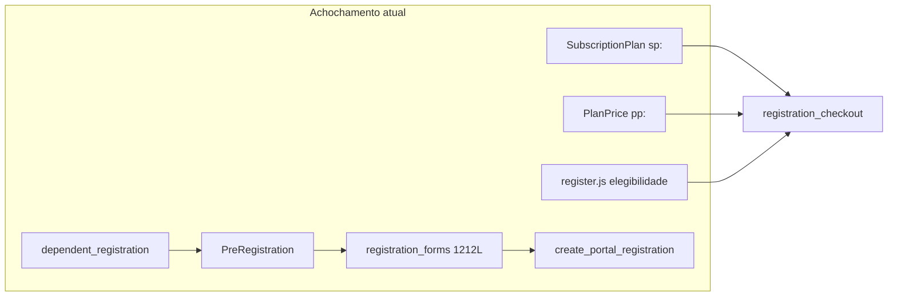

# PRD-138: Auditoria arquitetural — fluxo único e consistência do MVP

## Summary

Auditoria read-only completa do código LV JIU JITSU (jul/2026), cobrindo backend de domínio (`models`, `forms`, `services`, `selectors`), camada HTTP (`views`, URLs, testes, commands), UI (`templates`, `static`) e governança documental. O sistema **não possui hoje um único fluxo consistente**: coexistem catálogo dual de planos, três caminhos de cadastro, regra de negócio triplicada (form/service/JS), 61 redirects PT temporários, 4 views órfãs, 4 funções mortas e documentação contradizendo o código. Nenhum template ou asset em `static/system/` é órfão; o acochamento está em **fluxos paralelos e god-modules**.

## Demand type

Revisão arquitetural total (read-only) + roteamento de consolidação. **Não implementa código** — define inventário, classificação, prioridades e PRDs de execução.

## Current problem

### Diagnóstico transversal (3 frentes de auditoria)

| Dimensão | Métrica | Achado principal |
|---|---|---|
| Backend domínio | 87 arquivos | ~40% ATIVO_INCONSISTENTE / LEGADO / DUPLICAÇÃO |
| HTTP | ~128 views, 100 rotas nomeadas | 4 views órfãs; 61 redirects PT; views gordas (home 733L) |
| UI | 92 templates, 27 assets | 0 órfãos; `register.js` 3700+ linhas com regra de negócio |
| Testes | 66 arquivos | Sem testes obsoletos de feature removida; ~25 rotas sem HTTP direto |
| Commands | 33 executáveis | 1 órfão (`seed_system_people_flow_samples`) |
| Docs | 138 PRDs | `UI-SCREEN-CONTRACT` cita arquivos inexistentes; README pula PRD-101–110 |

### Achochamento crítico (top 5)

1. **Catálogo dual de planos** — `SubscriptionPlan` (legado, prefixo `sp:`) convive com `PlanTier`/`PlanPrice` (novo, `pp:`) em checkout, forms, admin e memberships.
2. **Três caminhos de cadastro** — wizard `PreRegistration` → `finalize_pre_registration` → `form.save()` → `create_portal_registration` (legado); dependente via `dependent_registration`; validação em form + service + JS.
3. **Regra de negócio no frontend** — `register.js` e `dependent_registration.js` reimplementam elegibilidade já existente em `plan_eligibility.py`.
4. **God-modules** — `registration_forms.py` (1212L), `registration_checkout.py` (979L), `class_calendar.py` (1533L), `home_views.py` (733L), `register.js` (3700+L).
5. **Shell visual fragmentado** — sem `lv/base.html`; theme boot inline em home, wizard e planos; `?v=` inconsistente entre telas.

## Goal

Estabelecer **fonte de verdade arquitetural** para convergir o MVP a:

- um catálogo de plano (`PlanTier`/`PlanPrice`);
- um contrato de cadastro (snapshot → pagamento → materialização `Person`);
- validação autoritativa no backend;
- shell UI unificado;
- remoção incremental de legado comprovado (views/funções mortas, redirects PT, seeds obsoletos).

## Context Ledger

### Files read in full

- `AGENTS.md`, `CLAUDE.md`, `docs/PRD-STANDARD.md`
- Relatórios completos das auditorias read-only (jul/2026):
  - Backend: `system/models/`, `forms/`, `services/`, `selectors/` (87 arquivos)
  - HTTP: `system/views/`, `urls.py`, `system/tests/`, `management/commands/`
  - UI: `templates/`, `static/system/`, `docs/`

### Adjacent files consulted

- `docs/prd/README.md` (índice até PRD-137)
- `docs/UI-SCREEN-CONTRACT.md`
- PRDs relacionadas: 040, 076, 081, 097, 115, 127, 129, 130

### Internet / official documentation

- [Django MVT — separation of concerns](https://docs.djangoproject.com/en/5.2/misc/design-philosophies/#loose-coupling) — validação de que regra de negócio pertence a services, não views/forms/JS.

### Context7 / MCPs / tools verified

- Subagentes explore read-only (3 frentes paralelas)
- `rg`, inventário de arquivos, cruzamento rota-view-template

### Limitations found

- Auditoria read-only; nenhum teste executado nesta PRD.
- `staticfiles/` vazio localmente (collectstatic não evidenciado).
- Classificação por arquivo é heurística (referências + padrão); remoção exige confirmação em PRD de execução.

## Required skills

- `lv-task-intake` (concluída)
- `lv-prd` (esta PRD)
- `lv-cleanup-audit` (para cada PRD-filha)
- `lv-django-delivery` (execução backend)
- `lv-ui-delivery` (execução UI)

## Understanding approved

Solicitação do usuário (jul/2026): MVP/protótipo inaceitável com arquitetura e regra de negócio acochambradas; exige fluxo único consistente; revisão completa classificando todos os arquivos; PRD novo documentando tudo.

## Execution prompt

### Persona

Arquiteto de software Django, focado em fluxo único e remoção de legado com evidência.

### Action

Executar consolidações priorizadas (seção Plan), uma PRD-filha por onda, sem expandir escopo automaticamente.

### Context

Esta PRD é o mapa mestre; implementação ocorre em PRDs-filhas já existentes ou a criar.

### Constraints

- Confirmar referência antes de remover qualquer símbolo.
- Não declarar sistema limpo até ondas 1–3 concluídas com evidência.
- HG/produção exigem confirmação explícita.

### Acceptance criteria

- [ ] Catálogo público usa apenas `PlanTier`/`PlanPrice` (PRD-129/130/137)
- [ ] Finalização de cadastro não passa por `create_portal_registration` legado (PRD-081)
- [ ] Elegibilidade de plano vem do backend; JS só renderiza (PRD-129)
- [ ] 4 views órfãs e 4 funções mortas removidas com testes verdes
- [ ] `UI-SCREEN-CONTRACT.md` alinhado ao código real
- [ ] Redirects PT removidos ou com cronograma (PRD-078)

### Expected evidence

- `manage.py test system` após cada onda
- `rg` sem referências a símbolos removidos
- Browser wizard + home desktop/mobile após mudanças UI

### Output format

PRDs-filhas com checklist e evidência real; esta PRD atualizada com status por onda.

## Scope

### Inventário e classificação consolidada

#### Backend — `system/models/` (21 arquivos)

| Classificação | Arquivos |
|---|---|
| ATIVO_CONSISTENTE | `common`, `pre_registration`, `registration_order`, `product*`, `calendar`, `graduation`, `category`, `class_*`, `request_workflows`, `asaas`, `coupon`, `trial_access`, `audit`, `membership_timeline` |
| ATIVO_INCONSISTENTE | `person` (importa service), `membership` (query em property), `class_membership` (regra no model) |
| LEGADO_REESCREVER / DUPLICAÇÃO | **`plan.py`** — `SubscriptionPlan` + `PlanTier`/`PlanPrice`; `compute_gross_price` duplica service |

#### Backend — `system/forms/` (14 arquivos)

| Classificação | Arquivos |
|---|---|
| ATIVO_CONSISTENTE | `auth_forms`, `category_forms`, `class_forms`, `class_request_forms`, `graduation_forms`, `membership_pause_forms`, `plan_tier_forms`, `product_forms` |
| LEGADO_REESCREVER | **`registration_forms.py`** (1212L, god-form) |
| ATIVO_INCONSISTENTE / DUPLICAÇÃO | `dependent_forms` (654L, espelha registration), `plan_forms` (CRUD legado), `person_forms` (`save()` orquestra domínio), `access_request_forms` |

#### Backend — `system/services/` (47 arquivos)

| Classificação | Arquivos |
|---|---|
| ATIVO_CONSISTENTE | Maioria operacional: `membership`, `plan_change`, `family_pricing`, `stripe_*`, `asaas_*`, `graduation`, `class_requests`, `payroll_rules`, `product_*`, `coupon`, `portal_*`, `membership_timeline*`, etc. |
| LEGADO_REESCREVER | **`registration_checkout.py`** (979L, catálogo dual), **`registration.py`** (`create_portal_registration` legado) |
| ATIVO_INCONSISTENTE | `pre_registration` (finalização legada + 4 funções mortas), `dependent_registration` (fluxo paralelo), `plan_management` (CRUD legado), `class_calendar` (1533L) |
| DUPLICAÇÃO | `registration_validation` vs `registration_forms.clean`; `class_overview` vs `class_catalog`; precificação model vs `financial_transactions` |
| CÓDIGO_MORTO (funções) | `pre_registration.py`: `create_or_update_pre_registration`, `build_form_snapshot`, `get_pre_registration_for_session`, `restore_form_initial` |

#### Backend — `system/selectors/` (5 arquivos)

| Classificação | Arquivos |
|---|---|
| ATIVO_CONSISTENTE | `person_selectors`, `plan_eligibility`, `product_backorders` |
| ATIVO_INCONSISTENTE | `graduation` (N+1 em loop) |

#### HTTP — `system/views/` (~30 módulos, ~128 classes)

| Classificação | Exemplos |
|---|---|
| ATIVO_CONSISTENTE | CRUDs modais padrão (turmas, graduação, produtos, person_types) |
| CÓDIGO_MORTO (views sem rota) | `RegistrationStepValidationView`, `RootRedirectView`, `StudentScheduleView`, `InstructorCalendarView` (aliases) |
| LEGADO_REESCREVER / gordas | `home_views` (733L), `person_views` (611L), `auth_views` (563L), `dependent_views` (444L), `calendar_views` (659L) |

#### HTTP — redirects e rotas

| Item | Qtd | Classificação |
|---|---|---|
| Rotas nomeadas EN | 100 | ATIVO_CONSISTENTE (canônicas) |
| Redirects PT sem `name` | 61 | LEGADO_REESCREVER (PRD-078) |
| Rotas sem teste HTTP direto | ~25 | ATIVO_INCONSISTENTE (gap cobertura) |

#### HTTP — `system/tests/` (66 arquivos)

| Classificação | Notas |
|---|---|
| ATIVO_CONSISTENTE | ~60 arquivos alinhados ao fluxo atual |
| ATIVO_INCONSISTENTE | `test_family_pricing` (`LegacyPlanTierInteropTestCase`), `test_plan_change*`, `test_stripe_sync` (ainda usam `SubscriptionPlan`) |
| CÓDIGO_MORTO | Nenhum teste de feature removida |

#### HTTP — `management/commands/` (34 arquivos)

| Classificação | Arquivos |
|---|---|
| ATIVO_CONSISTENTE | Seeds canônicos, `lock_supabase_api_access`, `generate_due_asaas_charges`, `backfill_membership_timeline`, clears HG/prod |
| LEGADO / OBSOLETO | `seed_system_initial_subscription_plans_stripe` (JSON vazio) |
| ÓRFÃO | `seed_system_people_flow_samples` (só PRD-070) |

#### UI — `templates/` (92 arquivos)

| Classificação | Qtd aprox. | Notas |
|---|---|---|
| ATIVO_CONSISTENTE | ~62 | Hubs modais CRUD padrão |
| ATIVO_INCONSISTENTE | ~18 | Sem `base.css`, theme inline, `?v=` divergente |
| DUPLICAÇÃO | ~10 | Pares full-page vs modal (`person_form`/`person_form_modal`, `plan_form`/`plan_form_modal`) |
| LEGADO_REESCREVER | 2 | `register.html` + wizard |
| ÓRFÃO | **0** | Todos referenciados |

#### UI — `static/system/` (27 arquivos)

| Classificação | Arquivos |
|---|---|
| ATIVO_CONSISTENTE | `theme_boot.js`, `theme_toggle.js`, `crud_modal.js`, `modal_child.js`, `login.js`, hubs CSS/JS |
| LEGADO_REESCREVER | **`register.js`** (regra de negócio duplicada) |
| DUPLICAÇÃO | `dependent_registration.js` (paralelo ao register) |
| ÓRFÃO | **0** |

#### Documentação

| Arquivo | Classificação |
|---|---|
| `docs/UI-SCREEN-CONTRACT.md` | LEGADO_REESCREVER — cita `base.html`, `theme.js`, `crud_frame.js` inexistentes |
| `docs/prd/README.md` | ATIVO_INCONSISTENTE — gap PRD-101–110 no índice |
| `docs/prd/PRD-037` | LEGADO — contradiz Stripe ativo (PRD-041/137) |
| `docs/archive/static-documentation-legacy/` | LEGADO arquivado (OK) |

### Mapa de fluxos (estado atual)

**Fluxo alvo (único):** snapshot `PreRegistration` → pagamento (Asaas/Stripe) → `RegistrationFinalizeService` → `Person` + `Membership` — sem `create_portal_registration`, sem catálogo `sp:`, sem elegibilidade no JS.

## Out of scope

- Implementação de código nesta PRD (somente documentação e roteamento).
- Reset HG/produção ou deploy.
- Refatoração completa de `class_calendar.py` e `payroll_rules.py` (ondas posteriores).
- Remoção dos 61 redirects PT sem PRD de execução e testes.

## Impacted files

Inventário completo — todas as pastas auditadas. PRDs-filhas detalham diff por onda.

## Risks and edge cases

- Migrar `Membership.plan` → `plan_price` pode quebrar assinaturas Stripe/Asaas ativas.
- Remover `SubscriptionPlan` antes da migração bloqueia plano Veterano e testes legados.
- `register.js` é crítico ao cadastro público; mudança exige browser + pagamento sandbox.
- Redirects PT podem estar bookmarkados por usuários internos.

## Rules and constraints

- Uma fonte de verdade por regra (service/selector).
- Form fino; view fina; JS só UX.
- Remover só com `rg` zerado + testes verdes.
- Atualizar `?v=` ao alterar assets versionados.

## Plan

### Onda 1 — Limpeza comprovada (baixo risco)

- [ ] Remover 4 views órfãs: `RegistrationStepValidationView`, `RootRedirectView`, `StudentScheduleView`, `InstructorCalendarView`
- [ ] Remover 4 funções mortas em `pre_registration.py`
- [ ] Remover ou documentar `seed_system_people_flow_samples`
- [ ] Corrigir `DashboardRedirectView` duplicado em `views/__init__.py`
- [ ] Atualizar `docs/prd/README.md` (PRD-101–110)
- [ ] Marcar PRD-037 como histórica no índice

**PRDs existentes:** PRD-097, PRD-127

### Onda 2 — Unificar catálogo e cadastro (crítico)

- [ ] Migrar cadastro público para `PlanTier`/`PlanPrice` apenas (PRD-129)
- [ ] Migrar troca de plano (PRD-130)
- [ ] Extrair `RegistrationFinalizeService` — substituir `form.save()` → `create_portal_registration` (PRD-081)
- [ ] API read-model elegibilidade; JS só renderiza
- [ ] Fundir validação em `registration_validation` única

**PRDs existentes:** PRD-040, PRD-081, PRD-129, PRD-130, PRD-137

### Onda 3 — UI e shell único

- [ ] Criar `templates/lv/base.html` real (PRD-075 follow-up)
- [ ] Consolidar `register.js` / `dependent_registration.js` em componente compartilhado
- [ ] Unificar theme boot (remover IIFEs inline)
- [ ] Padronizar `?v=` por asset
- [ ] Atualizar `UI-SCREEN-CONTRACT.md`

**PRDs existentes:** PRD-075, PRD-084, PRD-118, PRD-122

### Onda 4 — Extração de god-modules

- [ ] Dividir `registration_checkout.py`
- [ ] Extrair `selectors/home_context.py` de `home_views.py`
- [ ] Dividir `class_calendar.py` (agenda / check-in / permissão)
- [ ] Reduzir `registration_forms.py` para form fino
- [ ] Mover regras de `Person`/`Membership` models para services/selectors

### Onda 5 — Redirects e deprecação final

- [ ] Cronograma remoção 61 redirects PT (PRD-078)
- [ ] Deprecar admin `plan_views`/`plan_forms` quando catálogo novo for único
- [ ] Remover `SubscriptionPlan` após migração de memberships

## Test plan

### Tests to author

- [ ] HTTP para actions financeiras sem cobertura: `exempt-order`, `mark-order-paid`, `refund-order`, `payout-*`, `cancel-membership`
- [ ] Guarda regressão: views órfãs não reaparecem (`test_lv_foundation_*` padrão)
- [ ] Contrato elegibilidade API vs `plan_eligibility.py`

### Execution authorization

Testes locais autorizados nas PRDs-filhas de execução.

### Execution evidence

- [ ] Não executado nesta PRD (auditoria read-only)

## Visual validation

- [ ] Não executado nesta PRD
- Obrigatório nas PRDs-filhas de UI (wizard, home, modais)

## ORM validation

- [ ] Não executado nesta PRD
- Obrigatório na migração catálogo (Onda 2)

## Quality validation

- [x] Inventário 87 arquivos backend classificados
- [x] Matriz 100 rotas nomeadas × views × templates
- [x] Inventário 92 templates + 27 assets (0 órfãos)
- [x] 66 testes classificados
- [x] 34 commands classificados
- [ ] `manage.py test system` — pendente (esta PRD não altera código)

## Evidence

### Auditoria read-only (jul/2026)

| Frente | Agente | Escopo | Resultado |
|---|---|---|---|
| Backend domínio | explore | models, forms, services, selectors | 87 arquivos; 4 funções mortas; catálogo dual |
| HTTP | explore | views, URLs, tests, commands | 4 views órfãs; 61 redirects PT; home_views 733L |
| UI/docs | explore | templates, static, docs | 0 órfãos; register.js legado; UI-SCREEN-CONTRACT desatualizado |

### Achados quantitativos

| Métrica | Valor |
|---|---|
| Arquivos backend auditados | 87 |
| ~consistentes | ~60% |
| ~inconsistentes/legado | ~40% |
| Templates | 92 (0 órfãos) |
| Assets static/system | 27 (0 órfãos) |
| Views órfãs | 4 |
| Funções mortas | 4 |
| Commands órfãos | 1 |
| Redirects PT temporários | 61 |

## Implemented

- [x] PRD-138 criada com inventário consolidado e plano por ondas
- [ ] Nenhum código alterado nesta entrega

## Cleanup findings

| ID | Severidade | Achado | Ação |
|---|---|---|---|
| C1 | CRÍTICA | Catálogo dual SubscriptionPlan + PlanTier/PlanPrice | Onda 2 — PRD-129/130 |
| C2 | CRÍTICA | Finalização cadastro via `create_portal_registration` | Onda 2 — PRD-081 |
| C3 | CRÍTICA | `registration_forms.py` 1212L | Onda 4 |
| C4 | CRÍTICA | `registration_checkout.py` 979L | Onda 4 |
| C5 | CRÍTICA | Elegibilidade duplicada JS vs backend | Onda 2 — PRD-129 |
| A1 | ALTA | 3 fluxos cadastro paralelos | Onda 2 |
| A2 | ALTA | `home_views.py` 733L | Onda 4 |
| A3 | ALTA | 4 views órfãs | Onda 1 — PRD-097 |
| A4 | ALTA | 61 redirects PT | Onda 5 — PRD-078 |
| A5 | ALTA | `UI-SCREEN-CONTRACT` obsoleto | Onda 3 |
| M1 | MÉDIA | ~25 rotas sem teste HTTP | Testes novos |
| M2 | MÉDIA | Pares template full-page vs modal | Onda 3 — redirecionar `?modal=1` |
| M3 | MÉDIA | `?v=` inconsistente | Onda 3 |
| B1 | BAIXA | Barrel `__init__.py` incompletos | Convenção ou padronizar |

## Follow-up PRDs

| PRD | Relação com esta auditoria |
|---|---|
| PRD-081 | Extrair serviços cadastro/pagamento |
| PRD-097 | Aliases calendário órfãos |
| PRD-078 | Redirects PT |
| PRD-129 | Cadastro público → PlanTier/PlanPrice |
| PRD-130 | Troca plano → catálogo novo |
| PRD-137 | Stripe/Asaas no catálogo novo |
| PRD-075/084 | Shell UI e tokens |
| PRD-118/122 | Dependente consolidado |

Novas PRDs só se onda exigir escopo não coberto acima.

## Deviations from plan

Nenhuma — esta PRD é documental.

## Pending

- Aprovação do usuário para iniciar Onda 1 (limpeza comprovada)
- Execução de testes ao implementar ondas
- Validação browser pós-mudanças UI

## Final status

**Concluída com limitações** — auditoria read-only e PRD mestre entregues; implementação das ondas 1–5 pendente de aprovação explícita por onda.
