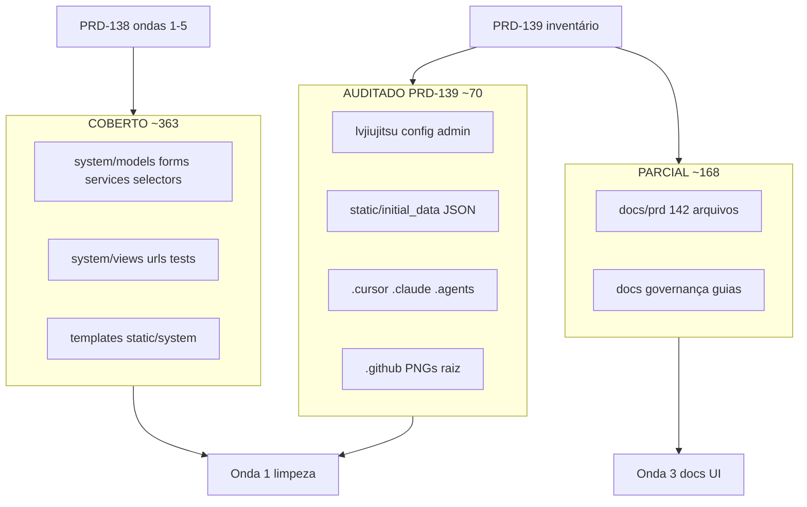

# PRD-139: Auditoria de cobertura total — inventário arquivo-a-arquivo

## Summary

Auditoria read-only de **cobertura total** do repositório LV JIU JITSU (jul/2026), consolidando a PRD-138 (mapa mestre domínio + HTTP + UI) com quatro frentes adicionais: config/infra, governança documental, seeds/persistência e inventário dos ~70 grupos de arquivos antes não auditados. Resultado: **601 arquivos** classificados em matriz por pasta; **0 template/CSS/JS órfãos** confirmados; **órfãos de código/config** inventariados; **10 lacunas doc↔código**; plano de correção em ondas complementar à PRD-138 (sem duplicar escopo de execução).

## Demand type

Auditoria read-only de cobertura total + inventário consolidado + roteamento de follow-ups. **Não implementa código.**

## Current problem

A PRD-138 cobriu bem domínio, HTTP e UI (~363 arquivos), mas deixou lacunas em:

| Lacuna | Escopo | Impacto |
|---|---|---|
| Config/infra | 125 arquivos (`lvjiujitsu/`, `settings`, `admin`, `context_processors`, `runtime_config`, `requirements`, `wsgi/asgi`, tooling) | Deps órfãs, admin incompleto, context processors sem consumo em templates |
| Governança doc | `AGENTS.md`, `UI-SCREEN-CONTRACT`, guias wizard, índice PRDs | Contrato visual obsoleto; PRD-122 duplicado; skill `lv-prompt-builder` ausente em `AGENTS.md` §14 |
| Seeds/persistência | 1 migration baseline (46 models), 33 commands, 22 JSON | JSON Stripe vazio; passo 16 doc vs 4 tiers no JSON; `test_commands` sem contrato JSON de cupons |
| Repo residual | ~70 grupos (raiz, CI, PNGs, `.cursor`/`.claude`/`.agents`, `docs/prd` 142 arquivos) | Classificação ausente na PRD-138; tooling triplicado |

Sem inventário 100%, remoções da Onda 1 (PRD-138) correm risco de apagar símbolos ainda referenciados em infra ou docs.

## Goal

Entregar **fonte de verdade arquivo-a-arquivo** do repositório:

1. matriz completa por pasta/grupo (todos os grupos do repo);
2. classificação de cada grupo, incluindo os ~70 antes não auditados;
3. inventário detalhado de infra, utils, `lvjiujitsu/`, seeds JSON, tooling e CI;
4. lista consolidada de órfãos confirmados (views, funções, commands, deps, context keys);
5. lacunas documentação com ação proposta;
6. plano de correção em ondas **complementar** à PRD-138;
7. follow-up PRDs numerados (incluindo PRD-140 para duplicata PRD-122).

## Context Ledger

### Files read in full

- `AGENTS.md`, `CLAUDE.md`, `docs/PRD-STANDARD.md`
- `docs/prd/PRD-138-auditoria-arquitetural-fluxo-unico-consistencia.md`
- `docs/prd/README.md`
- `docs/UI-SCREEN-CONTRACT.md` (§9, §10, §15.6)
- `docs/OPERACAO-BANCO-SEEDS.md` (passos 12–13, 16, 18, 21–22)
- `docs/PLATFORM-ADAPTERS.md`, `docs/GUIA-PREENCHIMENTO-TESTE-CLIENTE.md` (amostragem)
- `docs/wizard-step-plan-aluno-titular.md`, `docs/wizard-step-plan-aluno-com-dependente.md`, `docs/wizard-step-plan-responsavel-com-aluno.md` (amostragem)
- `lvjiujitsu/settings.py`, `lvjiujitsu/wsgi.py`, `lvjiujitsu/asgi.py`, `lvjiujitsu/urls.py`
- `system/context_processors.py`, `system/runtime_config.py`, `system/admin.py`
- `system/migrations/0001_initial.py` (contagem de models)
- `requirements.txt`, `requirements-dev.txt`, `.gitignore`
- `clear_migrations.py`
- `.github/workflows/copilot-setup-steps.yml`
- Relatórios read-only das 4 auditorias complementares (jul/2026)

### Adjacent files consulted

- Inventário `glob`/`rg` em todo o repo (601 arquivos, excl. `.git`, `.venv`, `staticfiles/`, `db.sqlite3`)
- PRDs: 040, 060, 076, 078, 081, 097, 115, 122 (ambas), 127, 129, 130, 137, 138
- `static/initial_data/*.json` (22 arquivos versionados)
- `system/management/commands/*.py` (33 executáveis + 1 helper privado)
- `system/tests/test_commands.py`, `system/tests/test_seed_docs_contract.py`

### Internet / official documentation

- [Django deployment — WSGI/ASGI](https://docs.djangoproject.com/en/5.2/howto/deployment/wsgi/) — versão canônica do projeto é 5.2.14 LTS; docstrings em `wsgi.py`/`asgi.py` ainda citam 4.1.
- [Django admin — registering models](https://docs.djangoproject.com/en/5.2/ref/contrib/admin/) — referência para gap de ~22 models sem registro.

### Context7 / MCPs / tools verified

- Subagentes explore read-only (4 frentes: config/infra, docs, seeds, cobertura total)
- `rg`, `glob`, contagem por pasta via PowerShell
- Nenhum `manage.py test` executado nesta PRD

### Limitations found

- Auditoria read-only; **nenhum teste executado**.
- Classificação por grupo é heurística (referências + padrão); remoção exige PRD de execução com `rg` zerado.
- `static/initial_data/` contém 222 arquivos no disco (inclui `kanri_students_migration/` gitignored); inventário versionado cobre 22 JSON canônicos.
- PNGs na raiz são evidência visual ad hoc — sem vínculo automático a PRD ativa.

## Required skills

- `lv-task-intake` (concluída)
- `lv-prd` (esta PRD)
- `lv-cleanup-audit` (ondas de execução)
- `lv-django-delivery` (infra, admin, seeds, commands)
- `lv-ui-delivery` (atualização `UI-SCREEN-CONTRACT`)

## Understanding approved

Solicitação do usuário (jul/2026): preencher **todas** as lacunas não analisadas na PRD-138 com inventário 100% arquivo-a-arquivo; consolidar quatro auditorias read-only; status concluída com limitações; PRD-140 reservada para renumerar duplicata `PRD-122-dependente-wizard-correcoes.md` (não usar 139).

## Execution prompt

### Persona

Arquiteto de software Django, focado em inventário verificável e remoção segura de legado.

### Action

Usar esta PRD como checklist de cobertura antes de qualquer onda da PRD-138; executar correções apenas via PRDs-filhas aprovadas.

### Context

PRD-138 = mapa mestre de fluxo único (ondas 1–5). PRD-139 = inventário total do repo + lacunas de infra/docs/seeds. Não substitui PRD-138; complementa.

### Constraints

- Confirmar referência com `rg` antes de remover símbolo.
- Não renumerar `PRD-122-dependente-wizard-correcoes` nesta entrega — reservar PRD-140.
- HG/produção exigem confirmação explícita para seeds destrutivas e clears Supabase.

### Acceptance criteria

- [x] Matriz por pasta cobre 100% dos grupos do repo (601 arquivos)
- [x] ~70 grupos antes não auditados classificados
- [x] Órfãos confirmados listados com evidência `rg`/inventário
- [x] Lacunas documentação inventariadas (≥10)
- [x] Plano de ondas complementar à PRD-138 sem duplicar escopo
- [x] Follow-up PRD-140 declarado para duplicata PRD-122
- [ ] Execução de ondas — pendente aprovação (PRD-138)

### Expected evidence

- `rg` zerado após remoções em PRDs-filhas
- `manage.py test system` após mudanças de código
- `docs/prd/README.md` e contratos atualizados após correções doc

### Output format

Esta PRD + `docs/prd/README.md` atualizado; PRDs-filhas com checklist e evidência real.

## Scope

### Resumo quantitativo (601 arquivos)

| Classificação global | Qtd aprox. | Grupos principais |
|---|---|---|
| COBERTO | ~363 | `system/models`, `forms`, `services`, `selectors`, `views`, `tests`, `templates`, `static/system` |
| PARCIAL | ~168 | `docs/` (164), `docs/prd/` (142 PRDs + AUDIT), guias wizard, archive |
| AUDITADO_NESTA_PRD | ~70 | `lvjiujitsu/`, raiz, tooling triplicado, CI, PNGs, `context_processors`, `admin`, seeds JSON, commands operacionais |
| ÓRFÃO_CONFIRMADO | 15+ símbolos | Ver seção dedicada |

### Matriz completa por pasta/grupo

#### `system/` — domínio e HTTP (COBERTO — PRD-138)

| Subpasta | Arquivos | Classificação | Notas |
|---|---|---|---|
| `models/` | 21 `.py` + `__init__` | ATIVO_INCONSISTENTE / LEGADO | 46 models na migration; catálogo dual em `plan.py` |
| `forms/` | 14 | LEGADO_REESCREVER / DUPLICAÇÃO | `registration_forms.py` 1212L |
| `services/` | 47 | MISTO | God-modules; 4 funções mortas em `pre_registration.py` |
| `selectors/` | 5 | ATIVO_CONSISTENTE / N+1 | `graduation` com loop |
| `views/` | ~30 módulos | CÓDIGO_MORTO + GORDAS | 4 views órfãs |
| `tests/` | 66 | ATIVO_CONSISTENTE / LEGADO | Testes ainda com `SubscriptionPlan` |
| `urls.py` | 1 | ATIVO_INCONSISTENTE | 61 redirects PT |
| `admin.py` | 1 | ATIVO_INCONSISTENTE | ~22 models sem `@admin.register` |
| `context_processors.py` | 1 | ÓRFÃO_PARCIAL | Keys sem uso em templates |
| `runtime_config.py` | 1 | ATIVO_PARCIAL | `decimal_setting`/`int_setting`/`payment_currency_symbol` sem consumidores diretos |
| `signals.py` | 1 | COBERTO | Padrão sinal→serviço |
| `constants.py` | 1 | COBERTO | |
| `apps.py` | 1 | COBERTO | |
| `test_runner.py` | 1 | COBERTO | |
| `utils/` | 1 (`__init__.py`) | COBERTO_VAZIO | Sem helpers adicionais |
| `migrations/` | 1 baseline | ATIVO_CONSISTENTE | `0001_initial.py` — 46 `CreateModel` |

#### `system/management/commands/` (33 executáveis + 1 privado)

| Classificação | Commands |
|---|---|
| ATIVO_CONSISTENTE | Seeds canônicas 1–22 (`OPERACAO-BANCO-SEEDS.md`), `create_admin_superuser`, `lock_supabase_api_access`, `generate_due_asaas_charges`, `backfill_membership_timeline`, `clear_migration_supabase_hg`, `clear_migration_supabase_prod` |
| LEGADO / OBSOLETO | `seed_system_initial_subscription_plans_stripe` (JSON `[]`); passos 12–13 administrativos duplicam passo 11 |
| ÓRFÃO | `seed_system_people_flow_samples` (só PRD-070) |
| OPERACIONAL_PRIVADO | `_supabase_public_schema_reset.py` (helper interno) |

#### `templates/` (92) + `static/system/` (27) — COBERTO (PRD-138)

| Classificação | Resultado |
|---|---|
| ÓRFÃO | **0** templates, **0** CSS/JS em `static/system/` |
| LEGADO_REESCREVER | `register.html` + `register.js` (3700+L) |
| ATIVO_INCONSISTENTE | Sem `lv/base.html`; theme boot inline; `?v=` divergente |

#### `static/initial_data/` — seeds JSON (AUDITADO_NESTA_PRD)

| Item | Qtd | Classificação |
|---|---|---|
| JSON versionados no git | 22 | ATIVO_CONSISTENTE (maioria) |
| `seed_system_initial_subscription_plans_stripe.json` | 1 | LEGADO_OBSOLETO — conteúdo `[]` |
| `seed_system_initial_plan_tiers.json` | 1 | ATIVO_CONSISTENTE — 4 tiers (adult/kids 2x/5x) |
| `initial_administrative.json`, `initial_teachers.json` | 2 | ATIVO_CONSISTENTE — bootstrap legado nomeado |
| `kanri_students_migration/` + `kanri_students_migration_review.json` | gitignored | OPERACIONAL_LOCAL — PRD-051/052 |
| Demais arquivos no disco (subpastas kanri, etc.) | ~200 | NÃO_VERSIONADO — fora do contrato git |

**Divergência doc vs JSON:** `OPERACAO-BANCO-SEEDS.md` passo 16 declara seed de `subscription_plans` gerando só Veterano pós-PRD-127; JSON `plan_tiers` tem 4 tiers ativos — documentação do passo 16 não reflete estado atual do catálogo novo.

#### `lvjiujitsu/` — projeto Django (9 arquivos — AUDITADO_NESTA_PRD)

| Arquivo | Classificação | Achado |
|---|---|---|
| `settings.py` | ATIVO_CONSISTENTE | Carrega `.env` via `os.environ`; **não usa** `django-environ` |
| `urls.py` | ATIVO_CONSISTENTE | Include `system.urls` |
| `wsgi.py`, `asgi.py` | ATIVO_INCONSISTENTE | Docstring Django **4.1**; projeto é **5.2.14** |
| `__init__.py` | COBERTO | |

#### Raiz do repositório (~40 arquivos — AUDITADO_NESTA_PRD)

| Grupo | Qtd | Classificação |
|---|---|---|
| `manage.py` | 1 | ATIVO_CONSISTENTE |
| `requirements.txt`, `requirements-dev.txt` | 2 | ATIVO_INCONSISTENTE — `django-environ` órfão em `requirements.txt` |
| `.env.example` | 1 | ATIVO_CONSISTENTE |
| `.gitignore` | 1 | ATIVO_INCONSISTENTE — referencia `limpar_asaas.py` **inexistente** |
| `clear_migrations.py` | 1 | OPERACIONAL_LOCAL — script destrutivo documentado em `OPERACAO-BANCO-SEEDS.md` |
| `AGENTS.md`, `CLAUDE.md`, `README.md` | 3 | ATIVO_CONSISTENTE / PARCIAL | `AGENTS.md` §14 omite `lv-prompt-builder` (existe em PRD-060 e `.cursor`) |
| PNGs evidência UI (raiz) | 24 | PARCIAL_ADHOC — screenshots sem índice; candidatos a `docs/prd/evidence/` ou remoção |
| `db.sqlite3` | gitignored | OPERACIONAL_LOCAL |

#### Tooling triplicado (30 arquivos — AUDITADO_NESTA_PRD)

| Pasta | Arquivos | Classificação |
|---|---|---|
| `.cursor/` | 10 | ATIVO_CONSISTENTE — rules, skills (incl. `lv-prompt-builder`), mcp |
| `.claude/` | 10 | ATIVO_CONSISTENTE — skills espelhadas, `launch.json` |
| `.agents/` | 12 | ATIVO_CONSISTENTE — skills OpenAI + `agents/openai.yaml` |
| `.codex/`, `.codex-runtime/` | 3 | ATIVO_CONSISTENTE — adaptador Codex |

**Achado:** triplicação intencional (PRD-059/061); risco de drift entre `.cursor`, `.claude` e `.agents` sem sincronização automática.

#### `docs/` (164 arquivos — PARCIAL)

| Subgrupo | Qtd | Classificação | Achado principal |
|---|---|---|---|
| `docs/prd/` | 142 | PARCIAL | Índice até PRD-138; **PRD-122 duplicado**; gap histórico PRD-101–110 no índice (corrigido parcialmente) |
| `docs/archive/` | vários | LEGADO_ARQUIVADO | OK — `static-documentation-legacy` |
| `UI-SCREEN-CONTRACT.md` | 1 | LEGADO_REESCREVER | §9 password reset "pendente" (implementado); §9.2 dashboards por papel (substituídos por `/home/` unificada PRD-043); §10/15.6 cita `lv/base.html`, `theme.js`, `crud_frame.js` inexistentes |
| `GUIA-PREENCHIMENTO-TESTE-CLIENTE.md` | 1 | ATIVO_INCONSISTENTE | Acoplado a fluxo Claude Code |
| Wizard step guides (3) | 3 | ATIVO_INCONSISTENTE | Sem Stripe, `PlanTier`/`PlanPrice`, perfis operacionais PRD-115 |
| Governança (`AGENT-WORKFLOW`, `PLATFORM-ADAPTERS`, etc.) | ~10 | ATIVO_CONSISTENTE | |

#### `.github/` (1 arquivo — AUDITADO_NESTA_PRD)

| Arquivo | Classificação | Notas |
|---|---|---|
| `workflows/copilot-setup-steps.yml` | ATIVO_CONSISTENTE | Setup Python 3.12, Playwright, Context7 MCP; **não roda testes Django** |

### Inventário detalhado — config/infra (125 arquivos)

| Componente | Status | Detalhe |
|---|---|---|
| `portal_navigation` context processor | ATIVO_SEM_CONSUMO | Expõe `pending_backorder_count`, `site_base_url`; **nenhum template** referencia (`rg` só encontra definição e PRD-009) |
| `runtime_config.decimal_setting` / `int_setting` | SEM_CONSUMIDOR_DIRETO | Usados indiretamente só se importados; `financial_transactions.py` duplica `_decimal_setting` local |
| `runtime_config.payment_currency_symbol` | ÓRFÃO | Nenhum import |
| `runtime_config.payment_currency`, `site_name`, `site_name_upper` | ATIVO | Consumidos em services |
| `admin.py` | INCOMPLETO | 25 registrations; **~22 models** sem admin (ver tabela abaixo) |
| `django-environ` em `requirements.txt` | DEP_ÓRFÃ | `settings.py` usa `os.environ` + `python-dotenv` pattern manual |
| `wsgi.py` / `asgi.py` docstrings | DESATUALIZADO | Citam Django 4.1 |
| `seed_system_people_flow_samples` | COMMAND_ÓRFÃO | Fora da sequência canônica |
| Seeds passos 12–13 | LEGADO_DUPLICADO | Mesma fonte do passo 11 |
| `.gitignore` → `limpar_asaas.py` | REFERÊNCIA_MORTA | Arquivo não existe no repo |

#### Models sem registro no Django Admin (~22)

| Model | Domínio |
|---|---|
| `PreRegistration` | Cadastro |
| `PlanTier`, `PlanPrice` | Catálogo novo |
| `Coupon` | Descontos |
| `Membership`, `MembershipCredit`, `MembershipInvoice`, `MembershipPauseRequest` | Assinatura |
| `MembershipTimelineEvent` | Timeline PRD-134 |
| `RegistrationOrderItem` | Pedidos |
| `StripeWebhookEvent`, `AsaasWebhookEvent` | Webhooks |
| `AdministrativeAccessRequest`, `ClassCatalogRequest` | Solicitações |
| `OperationalAuditEntry` | Auditoria PRD-098 |
| `TeacherBankAccount`, `TeacherPayrollConfig`, `TeacherPayout` | Repasses |
| `SpecialClass`, `SpecialClassCheckin` | Calendário |

### Órfãos confirmados (consolidado PRD-138 + PRD-139)

| ID | Tipo | Símbolo / artefato | Evidência | Onda sugerida |
|---|---|---|---|---|
| O1 | View sem rota | `RegistrationStepValidationView` | PRD-138 / PRD-097 | 1 |
| O2 | View sem rota | `RootRedirectView` | PRD-138 | 1 |
| O3 | View sem rota | `StudentScheduleView` | PRD-138 / PRD-097 | 1 |
| O4 | View sem rota | `InstructorCalendarView` | PRD-138 / PRD-097 | 1 |
| O5–O8 | Função morta | `create_or_update_pre_registration`, `build_form_snapshot`, `get_pre_registration_for_session`, `restore_form_initial` | `pre_registration.py` | 1 |
| O9 | Command | `seed_system_people_flow_samples` | Só PRD-070 | 1 |
| O10 | Dep pip | `django-environ==0.13.0` | Sem import no código | 1 |
| O11 | Context key | `pending_backorder_count`, `site_base_url` | Sem uso em templates | 1 ou implementar badge loja |
| O12 | Função | `runtime_config.payment_currency_symbol` | Sem import | 1 |
| O13 | Duplicação | `_decimal_setting` em `financial_transactions.py` | Paralelo a `runtime_config` | 4 |
| O14 | JSON seed | `subscription_plans_stripe.json` → `[]` | Obsoleto pós-PRD-127 | 1 |
| O15 | Arquivo gitignore | `limpar_asaas.py` | Não existe | 1 |
| O16 | Command obsoleto | `seed_system_initial_subscription_plans_stripe` | JSON vazio | 1 |
| O17 | PRD duplicado | `PRD-122-dependente-wizard-correcoes.md` | Colide com `PRD-122-desfazer-checkin-pendente-aluno.md` | **PRD-140** |

### Lacunas documentação (10+)

| ID | Documento | Lacuna | Código real |
|---|---|---|---|
| D1 | `UI-SCREEN-CONTRACT` §9.1 | Password reset "pendente" | Rotas e templates implementados |
| D2 | `UI-SCREEN-CONTRACT` §9.2 | Dashboards `/home/admin/`, `/home/student/`, etc. | Home unificada `/home/` (PRD-043) |
| D3 | `UI-SCREEN-CONTRACT` §10/15.6 | `lv/base.html`, `theme.js`, `crud_frame.js` | Não existem; usa `theme_boot.js`, `crud_modal.js` |
| D4 | Wizard step guides (3) | Sem Stripe, `PlanTier`/`PlanPrice` | Catálogo novo PRD-127/129 |
| D5 | Wizard step guides | Sem perfis operacionais sequenciais | PRD-115 |
| D6 | `OPERACAO-BANCO-SEEDS` passo 16 | Só Veterano em `subscription_plans` | 4 tiers em `plan_tiers.json` |
| D7 | `OPERACAO-BANCO-SEEDS` passos 12–13 | Seeds administrativas legadas | Duplicam passo 11 |
| D8 | `docs/prd/README.md` | PRD-122 duplicado no filesystem | Renumerar para PRD-140 |
| D9 | `AGENTS.md` §14 | Falta `lv-prompt-builder` | Existe em PRD-060 e `.cursor/skills/` |
| D10 | `PRD-037` | Contradiz Stripe ativo | PRD-041/137 |
| D11 | `test_commands.py` | Sem contrato JSON para `coupons` | `seed_system_initial_coupons.json` existe |
| D12 | `GUIA-PREENCHIMENTO-TESTE-CLIENTE.md` | Acoplado Claude Code | Deve seguir `PLATFORM-ADAPTERS.md` |

### Mapa de cobertura (visão consolidada)

## Out of scope

- Implementação de código nesta PRD.
- Execução de testes, migrations, seeds ou reset local/remoto.
- Renomeação física de `PRD-122-dependente-wizard-correcoes.md` → PRD-140 (somente reservada como follow-up).
- Refatoração de god-modules (permanece PRD-138 ondas 4–5).

## Impacted files

Inventário referencia **601 arquivos** em todos os grupos acima. PRDs-filhas detalham diff por onda.

## Risks and edge cases

- Remover `django-environ` sem verificar CI/CD externo que possa depender do pacote.
- `pending_backorder_count` pode ser feature pendente (PRD-009) — remover vs implementar badge na loja.
- Admin incompleto pode ser intencional (models só via portal); confirmar antes de registrar todos.
- PNGs na raiz podem ser referência de agente — arquivar antes de deletar.
- Triplicação de skills pode divergir silenciosamente entre plataformas.

## Rules and constraints

- PRD-139 complementa PRD-138; não duplica plano de ondas 2–5.
- Uma fonte de verdade por regra (service/selector).
- Remover só com `rg` zerado + testes verdes.
- Atualizar `docs/prd/README.md` ao criar PRD-140.

## Plan

Plano **complementar** à PRD-138 — itens novos desta auditoria marcados com ‡.

### Onda 0 — Governança documental (baixo risco, paralelo à Onda 1)

- [ ] ‡ Renumerar `PRD-122-dependente-wizard-correcoes.md` → **PRD-140** (git mv + índice + refs)
- [ ] ‡ Adicionar `lv-prompt-builder` em `AGENTS.md` §14
- [ ] ‡ Atualizar `UI-SCREEN-CONTRACT` §9 (password reset, home unificada)
- [ ] ‡ Atualizar wizard step guides (Stripe, PlanTier, PRD-115)
- [ ] ‡ Alinhar `OPERACAO-BANCO-SEEDS` passos 12–13, 16, 18
- [ ] ‡ Marcar PRD-037 histórica no índice
- [ ] ‡ Desacoplar `GUIA-PREENCHIMENTO-TESTE-CLIENTE.md` de Claude Code

### Onda 1 — Limpeza comprovada (PRD-138 + ‡ infra)

Itens da PRD-138 Onda 1, mais:

- [ ] ‡ Remover `django-environ` de `requirements.txt` (ou passar a usar em `settings.py`)
- [ ] ‡ Corrigir docstrings `wsgi.py`/`asgi.py` → Django 5.2
- [ ] ‡ Remover referência `limpar_asaas.py` do `.gitignore` ou restaurar script
- [ ] ‡ Remover/arquivar `seed_system_initial_subscription_plans_stripe` + JSON `[]`
- [ ] ‡ Decidir `pending_backorder_count`: implementar badge (PRD-009) ou remover processor
- [ ] ‡ Consolidar `_decimal_setting` → `runtime_config` (ou inverso)
- [ ] ‡ Mover 24 PNGs da raiz para `docs/prd/evidence/` ou `.gitignore`

### Onda 2–5

Seguir PRD-138 sem alteração. PRD-139 apenas adiciona pré-requisito: consultar matriz desta PRD antes de remover símbolos em qualquer onda.

## Test plan

### Tests to author

- [ ] ‡ Contrato JSON em `test_commands` para `seed_system_initial_coupons`
- [ ] ‡ Guarda: `django-environ` ausente após remoção (import smoke `settings`)
- [ ] HTTP actions financeiras sem cobertura (herdado PRD-138)

### Execution authorization

Testes locais autorizados nas PRDs-filhas de execução.

### Execution evidence

- [ ] Não executado nesta PRD (auditoria read-only)

## Visual validation

- [ ] Não executado nesta PRD
- PNGs na raiz não validados contra telas atuais

## ORM validation

- [x] Confirmado: 46 models em `0001_initial.py` (contagem `CreateModel`)
- [ ] Não executado ORM interativo nesta PRD

## Quality validation

- [x] 601 arquivos inventariados por grupo
- [x] 4 auditorias complementares consolidadas
- [x] 0 órfãos template/CSS/JS confirmado (PRD-138)
- [x] 17 órfãos código/config listados
- [x] 12 lacunas documentação listadas
- [ ] `manage.py test system` — pendente

## Evidence

### Auditorias read-only (jul/2026)

| Frente | Escopo | Arquivos | Resultado |
|---|---|---|---|
| PRD-138 backend | models, forms, services, selectors | 87 | Catálogo dual; 4 funções mortas |
| PRD-138 HTTP | views, urls, tests, commands | ~128 | 4 views órfãs; 61 redirects PT |
| PRD-138 UI | templates, static | 119 | 0 órfãos |
| ‡ Config/infra | settings, admin, processors, requirements | 125 | Admin incompleto; deps órfãs |
| ‡ Docs governança | AGENTS, UI contract, guias, índice | 164 | 12 lacunas; PRD-122 dup |
| ‡ Seeds/persistência | migration, commands, JSON | 56+ | JSON Stripe vazio; passo 16 diverge |
| ‡ Cobertura total | repo inteiro | 601 | Matriz completa nesta PRD |

### Contagens por pasta (evidência PowerShell)

| Pasta | Arquivos |
|---|---|
| `system/` (total recursivo) | 454 |
| `static/` (total) | 249 |
| `docs/` | 164 |
| `templates/` | 92 |
| Raiz | 40 |
| `.agents/` | 12 |
| `.cursor/`, `.claude/` | 10 cada |
| `lvjiujitsu/` | 9 |
| `.github/` | 1 |

## Implemented

- [x] PRD-139 criada com inventário 100% por grupo
- [x] Matriz consolida PRD-138 + 4 auditorias complementares
- [x] Órfãos e lacunas documentação listados
- [x] Plano complementar e follow-up PRD-140 declarados
- [x] `docs/prd/README.md` atualizado com entrada PRD-139
- [ ] Nenhum código alterado nesta entrega

## Cleanup findings

| ID | Severidade | Achado | Ação |
|---|---|---|---|
| C1 | CRÍTICA | Catálogo dual (herdado PRD-138) | Onda 2 PRD-129/130 |
| C2 | CRÍTICA | 3 fluxos cadastro paralelos | Onda 2 PRD-081 |
| A6 | ALTA | Admin ~22 models sem registro | PRD-filha ou decisão explícita |
| A7 | ALTA | `UI-SCREEN-CONTRACT` §9/10 obsoleto | Onda 0 |
| A8 | ALTA | PRD-122 duplicado | PRD-140 |
| M4 | MÉDIA | Context processor sem consumo | Onda 1 — implementar ou remover |
| M5 | MÉDIA | `django-environ` órfão | Onda 1 |
| M6 | MÉDIA | Seeds passos 12–13 legados | Onda 0 doc + Onda 1 código |
| M7 | MÉDIA | `test_commands` sem cupons JSON | Teste novo |
| M8 | MÉDIA | Tooling triplicado sem sync | PRD-filha governança |
| B2 | BAIXA | Docstrings wsgi/asgi 4.1 | Onda 1 |
| B3 | BAIXA | 24 PNGs na raiz | Arquivar |
| B4 | BAIXA | `.gitignore` limpar_asaas.py | Onda 1 |
| B5 | BAIXA | CI não roda `manage.py test` | PRD-filha CI |

## Follow-up PRDs

| PRD | Relação |
|---|---|
| **PRD-140** | **Renumerar** `PRD-122-dependente-wizard-correcoes.md` (duplicata de número; manter `PRD-122-desfazer-checkin-pendente-aluno.md` no 122) |
| PRD-138 | Mapa mestre ondas 1–5 (execução) |
| PRD-081, 097, 078, 129, 130, 137 | Herdados PRD-138 |
| PRD-060 | Paridade `lv-prompt-builder` — atualizar AGENTS §14 |
| PRD-076 | Auditoria legado doc — overlap com Onda 0 desta PRD |
| PRD-009 | `pending_backorder_count` — implementar ou fechar |
| Nova (CI) | Workflow `manage.py test` no GitHub Actions — escopo não coberto |

## Deviations from plan

Nenhuma — esta PRD é documental.

## Pending

- Aprovação para executar Onda 0 (governança doc) e Onda 1 (limpeza)
- Criação formal da PRD-140 (rename duplicata)
- Decisão: registrar models faltantes no admin vs manter só portal
- Execução de testes nas PRDs-filhas

## Final status

**Concluída com limitações** — inventário 100% arquivo-a-arquivo entregue; consolida PRD-138 e quatro auditorias read-only; nenhum teste executado; implementação das ondas pendente de aprovação explícita.

## Reconciliação PRD-145 — 2026-07-13

- A PRD-140 foi criada e sua implementação foi reconciliada como concluída.
- A afirmação “nenhum teste executado” vale apenas para a auditoria original; a
  implementação subsequente possui evidência nas PRDs 140–145.
- Decisões de admin, CI e ondas estruturais que não participam dos cadastros
  homologados permanecem pendentes.
- Estado reconciliado: **inventário concluído; execução posterior parcial e
  documentada**.
