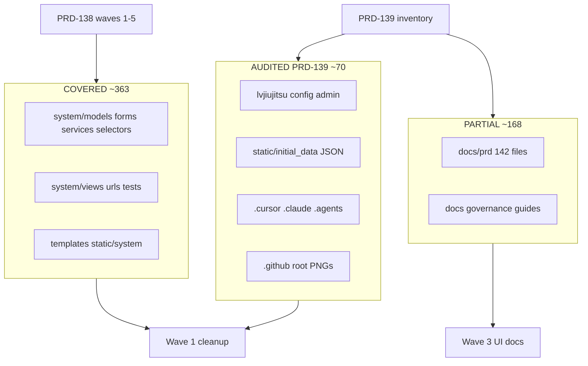

# PRD-139: Full-Coverage Audit — File-by-File Inventory

## Summary

Read-only **full-coverage** audit of the LV JIU JITSU repository (Jul/2026),
consolidating PRD-138 (master domain + HTTP + UI map) with four additional
fronts: config/infrastructure, documentation governance, seeds/persistence, and
an inventory of the ~70 previously unaudited file groups. Result: **601 files**
classified in a folder matrix; **0 orphaned templates/CSS/JS** confirmed;
**code/config orphans** inventoried; **10 documentation↔code gaps**; and a
wave-based correction plan complementing PRD-138 without duplicating execution
scope.

## Demand type

Read-only full-coverage audit + consolidated inventory + follow-up routing.
**Does not implement code.**

## Current problem

PRD-138 covered the domain, HTTP, and UI well (~363 files), but left gaps in:

| Gap | Scope | Impact |
|---|---|---|
| Config/infrastructure | 125 files (`lvjiujitsu/`, settings, admin, context processors, runtime config, requirements, wsgi/asgi, tooling) | Orphaned dependencies, incomplete admin, context processors not consumed by templates |
| Documentation governance | `AGENTS.md`, `UI-SCREEN-CONTRACT`, wizard guides, PRD index | Obsolete visual contract; duplicate PRD-122; `lv-prompt-builder` skill absent from `AGENTS.md` §14 |
| Seeds/persistence | 1 baseline migration (46 models), 33 commands, 22 JSON files | Empty Stripe JSON; documented step 16 versus 4 tiers in JSON; `test_commands` without coupon JSON contract |
| Residual repository | ~70 groups (root, CI, PNGs, `.cursor`/`.claude`/`.agents`, `docs/prd` 142 files) | Missing classification in PRD-138; triplicated tooling |

Without a 100% inventory, removals in Wave 1 (PRD-138) risk deleting symbols
still referenced in infrastructure or documentation.

## Goal

Deliver a **file-by-file source of truth** for the repository:

1. complete matrix by folder/group (all repository groups);
2. classification of every group, including the ~70 previously unaudited;
3. detailed inventory of infrastructure, utilities, `lvjiujitsu/`, JSON seeds,
   tooling, and CI;
4. consolidated list of confirmed orphans (views, functions, commands,
   dependencies, context keys);
5. documentation gaps with a proposed action;
6. wave-based correction plan **complementing** PRD-138;
7. numbered follow-up PRDs (including PRD-140 for duplicate PRD-122).

## Context Ledger

### Files read in full

- `AGENTS.md`, `CLAUDE.md`, `docs/PRD-STANDARD.md`
- `docs/prd/PRD-138-architectural-audit-single-flow-and-consistency-of-mvp.md`
- `docs/prd/README.md`
- `docs/UI-SCREEN-CONTRACT.md` (§9, §10, §15.6)
- `docs/OPERACAO-BANCO-SEEDS.md` (steps 12–13, 16, 18, 21–22)
- `docs/PLATFORM-ADAPTERS.md`, `docs/GUIA-PREENCHIMENTO-TESTE-CLIENTE.md` (sample)
- `docs/wizard-step-plan-aluno-titular.md`, `docs/wizard-step-plan-aluno-com-dependente.md`, `docs/wizard-step-plan-responsavel-com-aluno.md` (sample)
- `lvjiujitsu/settings.py`, `lvjiujitsu/wsgi.py`, `lvjiujitsu/asgi.py`, `lvjiujitsu/urls.py`
- `system/context_processors.py`, `system/runtime_config.py`, `system/admin.py`
- `system/migrations/0001_initial.py` (model count)
- `requirements.txt`, `requirements-dev.txt`, `.gitignore`
- `clear_migrations.py`
- `.github/workflows/copilot-setup-steps.yml`
- Read-only reports from the 4 complementary audits (Jul/2026)

### Adjacent files consulted

- Repository-wide `glob`/`rg` inventory (601 files, excluding `.git`, `.venv`,
  `staticfiles/`, `db.sqlite3`)
- PRDs: 040, 060, 076, 078, 081, 097, 115, both 122s, 127, 129, 130, 137, 138
- `static/initial_data/*.json` (22 versioned files)
- `system/management/commands/*.py` (33 executable + 1 private helper)
- `system/tests/test_commands.py`, `system/tests/test_seed_docs_contract.py`

### Internet / official documentation

- [Django deployment — WSGI/ASGI](https://docs.djangoproject.com/en/5.2/howto/deployment/wsgi/) — the project's canonical version is 5.2.14 LTS; docstrings in `wsgi.py`/`asgi.py` still cite 4.1.
- [Django admin — registering models](https://docs.djangoproject.com/en/5.2/ref/contrib/admin/) — reference for the gap of ~22 unregistered models.

### Context7 / MCPs / tools verified

- Read-only explore subagents (4 fronts: config/infrastructure,
  documentation, seeds, full coverage)
- `rg`, `glob`, folder counts through PowerShell
- No `manage.py test` run in this PRD

### Limitations found

- Read-only audit; **no tests run**.
- Group classification is heuristic (references + pattern); removal requires an
  execution PRD with zero `rg` references.
- `static/initial_data/` contains 222 files on disk (including gitignored
  `kanri_students_migration/`); the versioned inventory covers 22 canonical
  JSON files.
- Root PNGs are ad hoc visual evidence, with no automatic link to an active PRD.

## Required skills

- `lv-task-intake` (completed)
- `lv-prd` (this PRD)
- `lv-cleanup-audit` (execution waves)
- `lv-django-delivery` (infrastructure, admin, seeds, commands)
- `lv-ui-delivery` (`UI-SCREEN-CONTRACT` update)

## Understanding approved

User request (Jul/2026): fill **all** gaps not analysed in PRD-138 with a 100%
file-by-file inventory; consolidate four read-only audits; final status
completed with limitations; reserve PRD-140 for renumbering duplicate
`PRD-122-undo-pending-student-checkin.md` (do not use 139).

## Execution prompt

### Persona

Django software architect focused on a verifiable inventory and safe legacy
removal.

### Action

Use this PRD as the coverage checklist before any PRD-138 wave; perform
corrections only through approved child PRDs.

### Context

PRD-138 = master single-flow map (waves 1–5). PRD-139 = total repository
inventory + infrastructure/documentation/seed gaps. It complements rather than
replaces PRD-138.

### Constraints

- Confirm references with `rg` before removing a symbol.
- Do not renumber `PRD-122-dependente-wizard-correcoes` in this delivery —
  reserve PRD-140.
- Staging/production require explicit confirmation for destructive seeds and
  Supabase clears.

### Acceptance criteria

- [x] Folder matrix covers 100% of repository groups (601 files)
- [x] ~70 previously unaudited groups classified
- [x] Confirmed orphans listed with `rg`/inventory evidence
- [x] Documentation gaps inventoried (≥10)
- [x] Wave plan complements PRD-138 without duplicating scope
- [x] Follow-up PRD-140 declared for duplicate PRD-122
- [ ] Wave execution — pending approval (PRD-138)

### Expected evidence

- Zero `rg` references after removals in child PRDs
- `manage.py test system` after code changes
- Updated `docs/prd/README.md` and contracts after documentation corrections

### Output format

This PRD + updated `docs/prd/README.md`; child PRDs with checklists and actual
evidence.

## Scope

### Quantitative summary (601 files)

| Global classification | Approx. qty | Main groups |
|---|---|---|
| COVERED | ~363 | `system/models`, `forms`, `services`, `selectors`, `views`, `tests`, `templates`, `static/system` |
| PARTIAL | ~168 | `docs/` (164), `docs/prd/` (142 PRDs + AUDIT), wizard guides, archive |
| AUDITED_IN_THIS_PRD | ~70 | `lvjiujitsu/`, root, triplicated tooling, CI, PNGs, `context_processors`, `admin`, JSON seeds, operational commands |
| CONFIRMED_ORPHAN | 15+ symbols | See dedicated section |

### Complete matrix by folder/group

#### `system/` — domain and HTTP (COVERED — PRD-138)

| Subfolder | Files | Classification | Notes |
|---|---|---|---|
| `models/` | 21 `.py` + `__init__` | ACTIVE_INCONSISTENT / LEGACY | 46 models in migration; dual catalog in `plan.py` |
| `forms/` | 14 | LEGACY_REWRITE / DUPLICATION | `registration_forms.py` 1212L |
| `services/` | 47 | MIXED | God modules; 4 dead functions in `pre_registration.py` |
| `selectors/` | 5 | ACTIVE_CONSISTENT / N+1 | `graduation` with a loop |
| `views/` | ~30 modules | DEAD_CODE + FAT | 4 orphaned views |
| `tests/` | 66 | ACTIVE_CONSISTENT / LEGACY | Tests still using `SubscriptionPlan` |
| `urls.py` | 1 | ACTIVE_INCONSISTENT | 61 PT redirects |
| `admin.py` | 1 | ACTIVE_INCONSISTENT | ~22 models without `@admin.register` |
| `context_processors.py` | 1 | PARTIAL_ORPHAN | Keys unused in templates |
| `runtime_config.py` | 1 | PARTIAL_ACTIVE | `decimal_setting`/`int_setting`/`payment_currency_symbol` without direct consumers |
| `signals.py` | 1 | COVERED | Signal→service pattern |
| `constants.py` | 1 | COVERED | |
| `apps.py` | 1 | COVERED | |
| `test_runner.py` | 1 | COVERED | |
| `utils/` | 1 (`__init__.py`) | COVERED_EMPTY | No additional helpers |
| `migrations/` | 1 baseline | ACTIVE_CONSISTENT | `0001_initial.py` — 46 `CreateModel` operations |

#### `system/management/commands/` (33 executable + 1 private)

| Classification | Commands |
|---|---|
| ACTIVE_CONSISTENT | Canonical seeds 1–22 (`OPERACAO-BANCO-SEEDS.md`), `create_admin_superuser`, `lock_supabase_api_access`, `generate_due_asaas_charges`, `backfill_membership_timeline`, `clear_migration_supabase_hg`, `clear_migration_supabase_prod` |
| LEGACY / OBSOLETE | `seed_system_initial_subscription_plans_stripe` (JSON `[]`); administrative steps 12–13 duplicate step 11 |
| ORPHAN | `seed_system_people_flow_samples` (PRD-070 only) |
| PRIVATE_OPERATIONAL | `_supabase_public_schema_reset.py` (internal helper) |

#### `templates/` (92) + `static/system/` (27) — COVERED (PRD-138)

| Classification | Result |
|---|---|
| ORPHAN | **0** templates, **0** CSS/JS under `static/system/` |
| LEGACY_REWRITE | `register.html` + `register.js` (3700+L) |
| ACTIVE_INCONSISTENT | No `lv/base.html`; inline theme boot; divergent `?v=` |

#### `static/initial_data/` — JSON seeds (AUDITED_IN_THIS_PRD)

| Item | Qty | Classification |
|---|---|---|
| JSON files versioned in Git | 22 | ACTIVE_CONSISTENT (majority) |
| `seed_system_initial_subscription_plans_stripe.json` | 1 | LEGACY_OBSOLETE — content `[]` |
| `seed_system_initial_plan_tiers.json` | 1 | ACTIVE_CONSISTENT — 4 tiers (adult/kids 2x/5x) |
| `initial_administrative.json`, `initial_teachers.json` | 2 | ACTIVE_CONSISTENT — named legacy bootstrap |
| `kanri_students_migration/` + `kanri_students_migration_review.json` | gitignored | LOCAL_OPERATIONAL — PRD-051/052 |
| Other files on disk (Kanri subfolders, etc.) | ~200 | UNVERSIONED — outside Git contract |

**Documentation versus JSON divergence:** `OPERACAO-BANCO-SEEDS.md` step 16
declares a `subscription_plans` seed producing only Veteran after PRD-127; the
`plan_tiers` JSON has 4 active tiers — step 16 documentation does not reflect
the current new-catalog state.

#### `lvjiujitsu/` — Django project (9 files — AUDITED_IN_THIS_PRD)

| File | Classification | Finding |
|---|---|---|
| `settings.py` | ACTIVE_CONSISTENT | Loads `.env` through `os.environ`; **does not use** `django-environ` |
| `urls.py` | ACTIVE_CONSISTENT | Includes `system.urls` |
| `wsgi.py`, `asgi.py` | ACTIVE_INCONSISTENT | Django **4.1** docstring; project is **5.2.14** |
| `__init__.py` | COVERED | |

#### Repository root (~40 files — AUDITED_IN_THIS_PRD)

| Group | Qty | Classification |
|---|---|---|
| `manage.py` | 1 | ACTIVE_CONSISTENT |
| `requirements.txt`, `requirements-dev.txt` | 2 | ACTIVE_INCONSISTENT — orphaned `django-environ` in `requirements.txt` |
| `.env.example` | 1 | ACTIVE_CONSISTENT |
| `.gitignore` | 1 | ACTIVE_INCONSISTENT — references nonexistent `limpar_asaas.py` |
| `clear_migrations.py` | 1 | LOCAL_OPERATIONAL — destructive script documented in `OPERACAO-BANCO-SEEDS.md` |
| `AGENTS.md`, `CLAUDE.md`, `README.md` | 3 | ACTIVE_CONSISTENT / PARTIAL | `AGENTS.md` §14 omits `lv-prompt-builder` (exists in PRD-060 and `.cursor`) |
| UI evidence PNGs (root) | 24 | PARTIAL_AD_HOC — screenshots without an index; candidates for `docs/prd/evidence/` or removal |
| `db.sqlite3` | gitignored | LOCAL_OPERATIONAL |

#### Triplicated tooling (30 files — AUDITED_IN_THIS_PRD)

| Folder | Files | Classification |
|---|---|---|
| `.cursor/` | 10 | ACTIVE_CONSISTENT — rules, skills (including `lv-prompt-builder`), MCP |
| `.claude/` | 10 | ACTIVE_CONSISTENT — mirrored skills, `launch.json` |
| `.agents/` | 12 | ACTIVE_CONSISTENT — OpenAI skills + `agents/openai.yaml` |
| `.codex/`, `.codex-runtime/` | 3 | ACTIVE_CONSISTENT — Codex adapter |

**Finding:** intentional triplication (PRD-059/061); risk of drift between
`.cursor`, `.claude`, and `.agents` without automatic synchronisation.

#### `docs/` (164 files — PARTIAL)

| Subgroup | Qty | Classification | Main finding |
|---|---|---|---|
| `docs/prd/` | 142 | PARTIAL | Index through PRD-138; **duplicate PRD-122**; historical PRD-101–110 index gap (partially corrected) |
| `docs/archive/` | several | ARCHIVED_LEGACY | OK — `static-documentation-legacy` |
| `UI-SCREEN-CONTRACT.md` | 1 | LEGACY_REWRITE | §9 password reset "pending" (implemented); §9.2 dashboards by role (replaced by unified `/home/` in PRD-043); §10/15.6 cites nonexistent `lv/base.html`, `theme.js`, `crud_frame.js` |
| `GUIA-PREENCHIMENTO-TESTE-CLIENTE.md` | 1 | ACTIVE_INCONSISTENT | Coupled to Claude Code flow |
| Wizard step guides (3) | 3 | ACTIVE_INCONSISTENT | No Stripe, `PlanTier`/`PlanPrice`, PRD-115 operational profiles |
| Governance (`AGENT-WORKFLOW`, `PLATFORM-ADAPTERS`, etc.) | ~10 | ACTIVE_CONSISTENT | |

#### `.github/` (1 file — AUDITED_IN_THIS_PRD)

| File | Classification | Notes |
|---|---|---|
| `workflows/copilot-setup-steps.yml` | ACTIVE_CONSISTENT | Python 3.12 setup, Playwright, Context7 MCP; **does not run Django tests** |

### Detailed inventory — config/infrastructure (125 files)

| Component | Status | Detail |
|---|---|---|
| `portal_navigation` context processor | ACTIVE_UNUSED | Exposes `pending_backorder_count`, `site_base_url`; **no template** references them (`rg` finds only the definition and PRD-009) |
| `runtime_config.decimal_setting` / `int_setting` | NO_DIRECT_CONSUMER | Used indirectly only if imported; `financial_transactions.py` duplicates local `_decimal_setting` |
| `runtime_config.payment_currency_symbol` | ORPHAN | No import |
| `runtime_config.payment_currency`, `site_name`, `site_name_upper` | ACTIVE | Consumed in services |
| `admin.py` | INCOMPLETE | 25 registrations; **~22 models** without admin (see table below) |
| `django-environ` in `requirements.txt` | ORPHANED_DEP | `settings.py` uses `os.environ` + manual `python-dotenv` pattern |
| `wsgi.py` / `asgi.py` docstrings | OUTDATED | Cite Django 4.1 |
| `seed_system_people_flow_samples` | ORPHANED_COMMAND | Outside the canonical sequence |
| Seed steps 12–13 | DUPLICATED_LEGACY | Same source as step 11 |
| `.gitignore` → `limpar_asaas.py` | DEAD_REFERENCE | File does not exist in repository |

#### Models not registered in Django Admin (~22)

| Model | Domain |
|---|---|
| `PreRegistration` | Registration |
| `PlanTier`, `PlanPrice` | New catalog |
| `Coupon` | Discounts |
| `Membership`, `MembershipCredit`, `MembershipInvoice`, `MembershipPauseRequest` | Subscription |
| `MembershipTimelineEvent` | PRD-134 timeline |
| `RegistrationOrderItem` | Orders |
| `StripeWebhookEvent`, `AsaasWebhookEvent` | Webhooks |
| `AdministrativeAccessRequest`, `ClassCatalogRequest` | Requests |
| `OperationalAuditEntry` | PRD-098 audit |
| `TeacherBankAccount`, `TeacherPayrollConfig`, `TeacherPayout` | Payouts |
| `SpecialClass`, `SpecialClassCheckin` | Calendar |

### Confirmed orphans (consolidated PRD-138 + PRD-139)

| ID | Type | Symbol / artefact | Evidence | Suggested wave |
|---|---|---|---|---|
| O1 | View without route | `RegistrationStepValidationView` | PRD-138 / PRD-097 | 1 |
| O2 | View without route | `RootRedirectView` | PRD-138 | 1 |
| O3 | View without route | `StudentScheduleView` | PRD-138 / PRD-097 | 1 |
| O4 | View without route | `InstructorCalendarView` | PRD-138 / PRD-097 | 1 |
| O5–O8 | Dead function | `create_or_update_pre_registration`, `build_form_snapshot`, `get_pre_registration_for_session`, `restore_form_initial` | `pre_registration.py` | 1 |
| O9 | Command | `seed_system_people_flow_samples` | PRD-070 only | 1 |
| O10 | Pip dependency | `django-environ==0.13.0` | No code import | 1 |
| O11 | Context key | `pending_backorder_count`, `site_base_url` | Unused in templates | 1 or implement store badge |
| O12 | Function | `runtime_config.payment_currency_symbol` | No import | 1 |
| O13 | Duplication | `_decimal_setting` in `financial_transactions.py` | Parallel to `runtime_config` | 4 |
| O14 | JSON seed | `subscription_plans_stripe.json` → `[]` | Obsolete after PRD-127 | 1 |
| O15 | Gitignore file | `limpar_asaas.py` | Does not exist | 1 |
| O16 | Obsolete command | `seed_system_initial_subscription_plans_stripe` | Empty JSON | 1 |
| O17 | Duplicate PRD | `PRD-122-undo-pending-student-checkin.md` | Collides with `PRD-122-undo-pending-student-checkin.md` | **PRD-140** |

### Documentation gaps (10+)

| ID | Document | Gap | Actual code |
|---|---|---|---|
| D1 | `UI-SCREEN-CONTRACT` §9.1 | Password reset "pending" | Routes and templates implemented |
| D2 | `UI-SCREEN-CONTRACT` §9.2 | `/home/admin/`, `/home/student/`, etc. dashboards | Unified `/home/` (PRD-043) |
| D3 | `UI-SCREEN-CONTRACT` §10/15.6 | `lv/base.html`, `theme.js`, `crud_frame.js` | Do not exist; uses `theme_boot.js`, `crud_modal.js` |
| D4 | Wizard step guides (3) | No Stripe, `PlanTier`/`PlanPrice` | New catalog PRD-127/129 |
| D5 | Wizard step guides | No sequential operational profiles | PRD-115 |
| D6 | `OPERACAO-BANCO-SEEDS` step 16 | Only Veteran in `subscription_plans` | 4 tiers in `plan_tiers.json` |
| D7 | `OPERACAO-BANCO-SEEDS` steps 12–13 | Legacy administrative seeds | Duplicate step 11 |
| D8 | `docs/prd/README.md` | Duplicate PRD-122 on filesystem | Renumber as PRD-140 |
| D9 | `AGENTS.md` §14 | Missing `lv-prompt-builder` | Exists in PRD-060 and `.cursor/skills/` |
| D10 | `PRD-037` | Contradicts active Stripe | PRD-041/137 |
| D11 | `test_commands.py` | No JSON contract for `coupons` | `seed_system_initial_coupons.json` exists |
| D12 | `GUIA-PREENCHIMENTO-TESTE-CLIENTE.md` | Coupled to Claude Code | Must follow `PLATFORM-ADAPTERS.md` |

### Coverage map (consolidated view)

## Out of scope

- Code implementation in this PRD.
- Running tests, migrations, seeds, or local/remote reset.
- Physical rename of `PRD-122-undo-pending-student-checkin.md` → PRD-140
  (reserved only as a follow-up).
- God-module refactor (remains in PRD-138 waves 4–5).

## Impacted files

The inventory references **601 files** across all groups above. Child PRDs
detail the diff by wave.

## Risks and edge cases

- Removing `django-environ` without checking external CI/CD that may depend on it.
- `pending_backorder_count` may be a pending feature (PRD-009) — remove versus implement store badge.
- Incomplete admin may be intentional (portal-only models); confirm before registering all.
- Root PNGs may be agent references — archive before deleting.
- Skill triplication may drift silently across platforms.

## Rules and constraints

- PRD-139 complements PRD-138; it does not duplicate the plan for waves 2–5.
- One source of truth per rule (service/selector).
- Remove only with zero `rg` references + green tests.
- Update `docs/prd/README.md` when creating PRD-140.

## Plan

Plan **complementing** PRD-138 — items new to this audit marked with ‡.

### Wave 0 — Documentation governance (low risk, parallel to Wave 1)

- [ ] ‡ Renumber `PRD-122-undo-pending-student-checkin.md` → **PRD-140** (`git mv` + index + refs)
- [ ] ‡ Add `lv-prompt-builder` to `AGENTS.md` §14
- [ ] ‡ Update `UI-SCREEN-CONTRACT` §9 (password reset, unified home)
- [ ] ‡ Update wizard step guides (Stripe, PlanTier, PRD-115)
- [ ] ‡ Align `OPERACAO-BANCO-SEEDS` steps 12–13, 16, 18
- [ ] ‡ Mark PRD-037 historical in the index
- [ ] ‡ Decouple `GUIA-PREENCHIMENTO-TESTE-CLIENTE.md` from Claude Code

### Wave 1 — Proven cleanup (PRD-138 + ‡ infrastructure)

PRD-138 Wave 1 items, plus:

- [ ] ‡ Remove `django-environ` from `requirements.txt` (or use it in `settings.py`)
- [ ] ‡ Correct `wsgi.py`/`asgi.py` docstrings → Django 5.2
- [ ] ‡ Remove the `limpar_asaas.py` reference from `.gitignore` or restore the script
- [ ] ‡ Remove/archive `seed_system_initial_subscription_plans_stripe` + JSON `[]`
- [ ] ‡ Decide `pending_backorder_count`: implement badge (PRD-009) or remove processor
- [ ] ‡ Consolidate `_decimal_setting` → `runtime_config` (or the reverse)
- [ ] ‡ Move 24 root PNGs to `docs/prd/evidence/` or `.gitignore`

### Waves 2–5

Follow PRD-138 unchanged. PRD-139 adds only this prerequisite: consult this
PRD's matrix before removing symbols in any wave.

## Test plan

### Tests to author

- [ ] ‡ JSON contract in `test_commands` for `seed_system_initial_coupons`
- [ ] ‡ Guard: `django-environ` absent after removal (`settings` import smoke test)
- [ ] Financial HTTP actions without coverage (inherited from PRD-138)

### Execution authorization

Local tests authorised in execution child PRDs.

### Execution evidence

- [ ] Not run in this PRD (read-only audit)

## Visual validation

- [ ] Not run in this PRD
- Root PNGs not validated against current screens

## ORM validation

- [x] Confirmed: 46 models in `0001_initial.py` (`CreateModel` count)
- [ ] No interactive ORM run in this PRD

## Quality validation

- [x] 601 files inventoried by group
- [x] 4 complementary audits consolidated
- [x] 0 orphaned templates/CSS/JS confirmed (PRD-138)
- [x] 17 code/config orphans listed
- [x] 12 documentation gaps listed
- [ ] `manage.py test system` — pending

## Evidence

### Read-only audits (Jul/2026)

| Front | Scope | Files | Result |
|---|---|---|---|
| PRD-138 backend | models, forms, services, selectors | 87 | Dual catalog; 4 dead functions |
| PRD-138 HTTP | views, URLs, tests, commands | ~128 | 4 orphaned views; 61 PT redirects |
| PRD-138 UI | templates, static | 119 | 0 orphans |
| ‡ Config/infrastructure | settings, admin, processors, requirements | 125 | Incomplete admin; orphaned dependencies |
| ‡ Documentation governance | AGENTS, UI contract, guides, index | 164 | 12 gaps; duplicate PRD-122 |
| ‡ Seeds/persistence | migration, commands, JSON | 56+ | Empty Stripe JSON; step 16 diverges |
| ‡ Full coverage | entire repository | 601 | Complete matrix in this PRD |

### Counts by folder (PowerShell evidence)

| Folder | Files |
|---|---|
| `system/` (recursive total) | 454 |
| `static/` (total) | 249 |
| `docs/` | 164 |
| `templates/` | 92 |
| Root | 40 |
| `.agents/` | 12 |
| `.cursor/`, `.claude/` | 10 each |
| `lvjiujitsu/` | 9 |
| `.github/` | 1 |

## Implemented

- [x] PRD-139 created with a 100% inventory by group
- [x] Matrix consolidates PRD-138 + 4 complementary audits
- [x] Orphans and documentation gaps listed
- [x] Complementary plan and PRD-140 follow-up declared
- [x] `docs/prd/README.md` updated with PRD-139 entry
- [ ] No code changed in this delivery

## Cleanup findings

| ID | Severity | Finding | Action |
|---|---|---|---|
| C1 | CRITICAL | Dual catalog (inherited from PRD-138) | Wave 2 PRD-129/130 |
| C2 | CRITICAL | 3 parallel registration flows | Wave 2 PRD-081 |
| A6 | HIGH | ~22 admin models unregistered | Child PRD or explicit decision |
| A7 | HIGH | Obsolete `UI-SCREEN-CONTRACT` §9/10 | Wave 0 |
| A8 | HIGH | Duplicate PRD-122 | PRD-140 |
| M4 | MEDIUM | Unused context processor | Wave 1 — implement or remove |
| M5 | MEDIUM | Orphaned `django-environ` | Wave 1 |
| M6 | MEDIUM | Legacy seed steps 12–13 | Wave 0 docs + Wave 1 code |
| M7 | MEDIUM | `test_commands` missing coupon JSON | New test |
| M8 | MEDIUM | Triplicated tooling without sync | Governance child PRD |
| B2 | LOW | wsgi/asgi 4.1 docstrings | Wave 1 |
| B3 | LOW | 24 root PNGs | Archive |
| B4 | LOW | `.gitignore` `limpar_asaas.py` | Wave 1 |
| B5 | LOW | CI does not run `manage.py test` | CI child PRD |

## Follow-up PRDs

| PRD | Relationship |
|---|---|
| **PRD-140** | **Renumber** `PRD-122-undo-pending-student-checkin.md` (duplicate number; retain `PRD-122-undo-pending-student-checkin.md` at 122) |
| PRD-138 | Master map waves 1–5 (execution) |
| PRD-081, 097, 078, 129, 130, 137 | Inherited from PRD-138 |
| PRD-060 | `lv-prompt-builder` parity — update AGENTS §14 |
| PRD-076 | Legacy documentation audit — overlaps Wave 0 of this PRD |
| PRD-009 | `pending_backorder_count` — implement or close |
| New (CI) | `manage.py test` workflow in GitHub Actions — uncovered scope |

## Deviations from plan

None — this PRD is documentary.

## Pending

- Approval to execute Wave 0 (documentation governance) and Wave 1 (cleanup)
- Formal creation of PRD-140 (rename duplicate)
- Decision: register missing models in admin versus portal-only
- Test execution in child PRDs

## Final status

**Completed with limitations** — 100% file-by-file inventory delivered;
consolidates PRD-138 and four read-only audits; no tests run; wave
implementation pending explicit approval.

## PRD-145 reconciliation — 2026-07-13

- PRD-140 was created, and its implementation was reconciled as completed.
- The statement "no tests run" applies only to the original audit; subsequent
  implementation has evidence in PRDs 140–145.
- Admin, CI, and structural-wave decisions not participating in the validated
  registrations remain pending.
- Reconciled state: **inventory completed; later execution partial and
  documented**.
