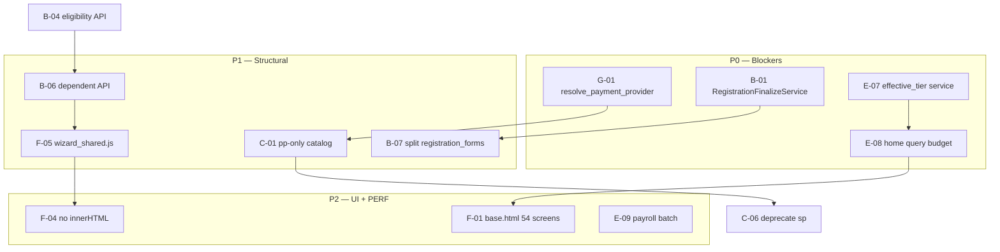

# PRD-144: Implementation Backlog — July 2026 Scan (PRD-138 Through PRD-143)

## Summary

Read-only consolidation (Jul 2026) of the **actual implementation status** of proposals from audit PRDs 138 through 143, cross-checking six scan reports against the current code. Aggregate result:

| Dimension | Estimated progress | Assessment |
|---|---|---|
| **Cleanup** (orphans, dead code, HTTP hygiene) | ~**80%** | PRD-138 phase 1 and PRD-143 P2 are largely complete |
| **Structural** (single registration flow, catalog, services, performance) | ~**15%** | Eligibility API and bulk graduation advanced; the architectural core remains dual |
| **Frontend** (PRD-141) | ~**24%** implemented / **76%** pending | Partial P0 (`base.html` pilot, `json_script`); P1/P2 nearly untouched |

This PRD **does not implement code** — it inventories pending work, prioritizes P0–P3 phases, references source PRDs, and proposes child implementation PRDs.

## Demand type

Proposal→code compliance audit (read-only) + backlog consolidator + implementation routing.

## Current problem

Between Jul 2026 and the partially authorized execution of PRDs 138–143, the repository evolved in an **unbalanced** way:

1. **Quick cleanup** — orphan views, dead functions in `pre_registration`, the `views/__init__.py` barrel, a unified administrative mixin, `registration_common.py`, the eligibility API, and bulk graduation were delivered.
2. **Stalled architectural core** — dual `sp:`/`pp:` catalog, nonexistent `RegistrationFinalizeService`, intact god forms, `effective_tier` querying in a property, and home without a query budget.
3. **Critical frontend** — `register.js` grew (~3,423L); 43× `innerHTML`; 54 standalone templates; no `wizard_shared.js`; 32/42 PRD-141 findings pending.
4. **Hardcoding and divergence** — `resolve_payment_provider_for_plan` ignores Stripe/`plan_price_ref`; `activate_membership_from_session` reads only `order.plan`; JS eligibility still diverges from the backend in the dependent wizard.

Without a single inventory, agents and developers reimplement already proposed fixes or declare work “complete” based on subsets (for example, eligibility API in the primary-member wizard but not the dependent wizard).

## Goal

1. Inventory **all** pending items by category with **IMPLEMENTED / PARTIAL / NO / PENDING** status.
2. Publish a prioritized **P0 / P1 / P2 / P3** matrix with cross-dependencies among PRDs 138–143.
3. Record the **top 20 blockers** and a concrete remediation proposal per phase.
4. Suggest numbered child PRDs when scope exceeds one phase.
5. Serve as a gate before new implementation phases.

## Context Ledger

### Files read in full

- `docs/PRD-STANDARD.md`, `AGENTS.md`, `CLAUDE.md`
- `docs/prd/PRD-138-architectural-audit-single-flow-and-consistency-of-mvp.md`
- `docs/prd/PRD-139-full-coverage-audit-file-by-file-inventory.md`
- `docs/prd/PRD-141-frontend-problem-review.md`
- `docs/prd/PRD-142-backend-performance-review.md`
- `docs/prd/PRD-143-mvt-views-models-and-forms-review.md`

### Adjacent files consulted

- Jul 2026 scan reports (read-only, session IDs):
  - **eea54931** — PRD-138 proposals vs code
  - **8fa93d30** — PRD-141 frontend
  - **f1fd3be3** — PRD-143 MVT
  - **026ceb4d** — PRD-142 performance
  - **91dd62fe** — hardcoding and configuration
  - **fe8894c9** — clean code and hygiene
- Targeted code verification: `register.js`, `home_views.py`, `home_context.py`, `membership.py`, `financial_transactions.py`, `templates/lv/base.html`, `system/tests/test_performance_graduation.py`, `system/tests/test_registration_eligibility_api.py`

### Internet / official documentation

- [Django design philosophies — Loose coupling](https://docs.djangoproject.com/en/5.2/misc/design-philosophies/#loose-coupling) — validation that business rules belong in services, not views/forms/JS.
- [Django — Database access optimization](https://docs.djangoproject.com/en/5.2/topics/db/optimization/) — query budgets and the N+1 anti-pattern.
- [MDN — `Element.innerHTML` security](https://developer.mozilla.org/en-US/docs/Web/API/Element/innerHTML#security_considerations) — XSS risk in wizards.

### Context7 / MCPs / tools verified

- `rg`, `Glob`, and `Read` in the workspace (without code changes).
- PowerShell line counts (Jul 2026).

### Limitations found

- Read-only scan; percentages are **heuristics** (closed items ÷ inventoried total), not LOC measurements.
- Reports 91dd62fe and fe8894c9 did not generate dedicated PRDs — their findings were absorbed into this consolidator.
- No HG `EXPLAIN ANALYZE`, Lighthouse, or axe run in this PRD.
- PRD-140 (dependent wizard) is a separate functional-fix scope — cited only where it intersects structural backlog.

## Required skills

- `lv-task-intake` (completed)
- `lv-prd` (this PRD)
- `lv-django-delivery` (backend execution)
- `lv-ui-delivery` (frontend execution)
- `lv-cleanup-audit` (closure of each phase)

## Understanding approved

Explicit request (Jul 2026): create PRD-144 consolidating implementation-scan findings for proposals in PRDs 138 through 143; COMPLETE template; update index; **do not implement code**.

## Execution prompt

### Persona

Consolidating architect — cross-check documented proposals against real code; classify status; prioritize without softening debt.

### Action

Use this PRD as the master checklist before opening a child implementation PRD; mark checkboxes only with diff + test evidence.

### Context

PRD-138 = master phase map. PRD-139 = full repository coverage. PRD-141/142/143 = layer-specific critiques. PRD-144 = **proposal→code compliance** after partial execution.

### Constraints

- Do not declare an item IMPLEMENTED without verifiable evidence.
- Do not automatically expand scope into PRD-140 without approval.
- HG/production require explicit confirmation for schema and backfill work.

### Acceptance criteria

- [x] PRD-144 created with the complete `docs/PRD-STANDARD.md` template
- [x] Inventory by category with IMPLEMENTED/PARTIAL/NO/PENDING status
- [x] P0–P3 matrix with cross-dependencies
- [x] PRD-138…143 reference for each item
- [x] Plan section with checkboxes
- [x] Top 20 blockers
- [x] Suggested follow-up PRDs
- [x] `docs/prd/README.md` updated
- [ ] Phase execution — pending approval

### Expected evidence

- Diff in child PRDs + `manage.py test system` + browser when UI is involved
- Zero-result `rg` for removed symbols
- Documented `assertNumQueries` budgets with command and output

### Output format

This document + updated index.

## Scope

### Quantitative scan summary

| Source (report) | Scope | Done | Pending | Pending rate |
|---|---|---:|---:|---|
| eea54931 | PRD-138 proposals (critical sample) | 3 | 3 | 50% (2 PARTIAL count as intermediate) |
| 8fa93d30 | 42 PRD-141 findings | 10 | 32 | **76%** |
| f1fd3be3 | Top 30 MVT + P2 (7 items) | ~12 | ~18 | ~60% structural |
| 026ceb4d | 30 priority PERF items (P0–P1) | 8 | 22 | **73%** |
| 91dd62fe | ~45 hardcodes/divergences | 0 | ~45 | **~100%** |
| fe8894c9 | Clean-code hygiene | partial | majority | qualitative |

### Status legend

| Status | Meaning |
|---|---|
| **IMPLEMENTED** | Proposal satisfied with code evidence and tests when applicable |
| **PARTIAL** | Part delivered; contract incomplete or only one flow/pilot |
| **NO** | Proposal not started or reverted |
| **PENDING** | Depends on another phase/PRD; blocked or awaiting approval |

---

## Inventory by category

### A. Cleanup and hygiene (PRD-138 phase 1, PRD-139, PRD-143 P2)

| ID | Item | Source | Status | Evidence / gap |
|---|---|---|---|---|
| A-01 | Remove four orphan views (`RegistrationStepValidationView`, `RootRedirectView`, `StudentScheduleView`, `InstructorCalendarView`) | PRD-138, PRD-097 | **IMPLEMENTED** | `rg` → 0 under `system/` |
| A-02 | Remove four dead functions in `pre_registration.py` | PRD-138 | **IMPLEMENTED** | `rg create_or_update_pre_registration` → 0 |
| A-03 | `seed_system_people_flow_samples` — remove or document outside the canonical flow | PRD-138, PRD-139 | **PARTIAL** | Command retained with `DeprecationWarning`; seed documentation updated |
| A-04 | `views/__init__.py` barrel — empty or complete | PRD-143 #19 | **IMPLEMENTED** | Barrel emptied; `urls.py` imports directly |
| A-05 | Single `AdministrativeRequiredMixin` | PRD-143 #21 | **IMPLEMENTED** | Canonical `portal_mixins.py`; nine views updated |
| A-06 | Public `get_instructor_class_group_ids` | PRD-143 #23 | **IMPLEMENTED** | Renamed in `class_calendar.py` |
| A-07 | `registration_common.py` (break god-form coupling) | PRD-143 #24 | **IMPLEMENTED** | `system/forms/registration_common.py` |
| A-08 | `ClassGroupForm.save()` → service | PRD-143 #11 | **IMPLEMENTED** | `class_management.sync_class_group_instructors` |
| A-09 | README index for PRD-101–110 | PRD-138, PRD-139 | **IMPLEMENTED** | Complete `docs/prd/README.md` |
| A-10 | Mark PRD-037 historical | PRD-138 | **IMPLEMENTED** | README entry |
| A-11 | Orphan `context_processors.py` | PRD-139 | **PENDING** | File removed in working tree; validate `settings.py` |
| A-12 | 61 PT redirects | PRD-138 phase 5 | **PENDING** | PRD-078 — not started |

**Cleanup subtotal:** ~80% of low-risk items in phase 1 + MVT P2 completed.

---

### B. Registration, finalization, and API (PRD-138 phase 2, PRD-143 P0, PRD-081)

| ID | Item | Source | Status | Evidence / gap |
|---|---|---|---|---|
| B-01 | Dedicated `RegistrationFinalizeService` | PRD-138, PRD-081, PRD-143 #2 | **IMPLEMENTED** | `system/services/registration_finalize.py`; `finalize_pre_registration` delegates |
| B-02 | `PortalRegistrationForm.save()` does not materialize the domain | PRD-143 #2 | **PARTIAL** | `NotImplementedError` in `save()`; finalize bypasses dedicated service |
| B-03 | Eliminate `pending_registration_person_id` | PRD-143 #3 | **IMPLEMENTED** | `rg pending_registration_person_id` → 0 |
| B-04 | Eligibility JSON API (`POST /cadastro/elegibilidade/`) | PRD-143 P0, PRD-141 C-01 | **IMPLEMENTED** | `RegistrationEligibilityView`; `test_registration_eligibility_api.py` (5 tests) |
| B-05 | Primary-member wizard JS consumes API (no local authority) | PRD-141 C-01/C-07 | **PARTIAL** | `register.js` uses `refreshEligibilityFromServer()`; local `resolveAudience` fallback remains |
| B-06 | Dependent wizard JS consumes API | PRD-141 C-01/C-03 | **NO** | `dependent_registration.js` is 100% client-side |
| B-07 | Split `registration_forms.py` (<400L) | PRD-143 #1 | **NO** | ~1,125L; god form intact |
| B-08 | Single validation source in `registration_validation.py` | PRD-143 #10 | **PARTIAL** | API uses `build_eligibility_context_from_wizard_data`; forms still duplicate `clean()` |
| B-09 | `dependent_registration_service` (thin view) | PRD-143 #7 | **PARTIAL** | Pure functions extracted; POST still ~120L in the view |
| B-10 | Unify checkout around `PreRegistration` only | PRD-040, PRD-138 | **PARTIAL** | Legacy Person path removed; finalize still uses legacy form |

---

### C. Plan catalog and membership (PRD-138 phases 2/5, PRD-129/130, PRD-143 P1)

| ID | Item | Source | Status | Evidence / gap |
|---|---|---|---|---|
| C-01 | Public catalog uses only `PlanTier`/`PlanPrice` (`pp:`) | PRD-129, PRD-138 C1 | **PARTIAL** | New registration uses `pp:`; `resolve_catalog_plan` still accepts `sp:` |
| C-02 | Dual `Membership.plan` + `plan_price` FKs | PRD-143 #4 | **NO** | Model unchanged; 8+ `effective_*` properties |
| C-03 | `effective_tier` / `current_pause` in service (no query in property) | PRD-143 #5, PRD-142 PERF-006/007 | **PARTIAL** | `resolve_effective_tier`/`resolve_current_pause` in `services/membership.py`; properties delegate |
| C-04 | `PlanPrice.save()` rule in a service | PRD-143 #17 | **NO** | Financial logic remains in model |
| C-05 | `recompute_billed_price()` in `family_pricing` | PRD-143 #18 | **NO** | Still in model |
| C-06 | Deprecate `plan_views`/`plan_forms` (SubscriptionPlan) | PRD-138 phase 5 | **PENDING** | Legacy CRUD active in parallel |
| C-07 | Plan change uses only the new catalog | PRD-130 | **PARTIAL** | `plan_change.py` supports both FKs |

---

### D. Views, home, and MVT (PRD-143 P1, PRD-142 PERF-002)

| ID | Item | Source | Status | Evidence / gap |
|---|---|---|---|---|
| D-01 | Extract `selectors/home_context.py` | PRD-142, PRD-143 #6 | **PARTIAL** | File created (~470L); `HomeView` ~257L (was 656L+) — orchestration remains in the view |
| D-02 | Home query budget (student / guardian+3 dependents) | PRD-142 PERF-002/003 | **PARTIAL** | `test_performance_home.py` ceilings 36/90; target ≤12/≤35 pending |
| D-03 | Eliminate `home_views` god module | PRD-138 A2, PRD-143 #6 | **PARTIAL** | Reduced; financial/payroll helpers remain coupled |
| D-04 | `PersonForm.save()` → service | PRD-143 #9 | **NO** | ~734L; orchestrates domain |
| D-05 | `PlanChangeSelectView.post` → transactional service | PRD-143 #13 | **NO** | Stripe cancellation in the view |
| D-06 | Thin `dependent_views` | PRD-143 #7 | **PARTIAL** | Partial service |
| D-07 | `Person.current_ibjjf_category` without query | PRD-143 #16 | **NO** | Querying property |
| D-08 | PRD-143 P2 (6/7 items) | PRD-143 Plan P2 | **IMPLEMENTED** | #11, #19–21, #23, #24 done; #12/#22 assessed as acceptable |

---

### E. Backend performance (PRD-142)

| ID | Item | Source | Status | Evidence / gap |
|---|---|---|---|---|
| E-01 | Bulk `get_graduation_overview` (≤15 q / 50 students) | PERF-001/010/011 | **IMPLEMENTED** | `compute_graduation_progress_bulk`; `test_performance_graduation.py` |
| E-02 | SQL aggregation in `_aggregate_net_inflows` | PERF-008 | **IMPLEMENTED** | `test_services.py::AggregateNetInflowsQueryBudgetTestCase` |
| E-03 | Calendar: `select_related` teacher + batched check-ins | PERF-005/013 | **IMPLEMENTED** | `class_calendar.py` |
| E-04 | Memoized `get_instructor_class_group_ids` | PERF-014 | **IMPLEMENTED** | Per `person` instance |
| E-05 | Deduplicated dependent billing | PERF-019/020 | **IMPLEMENTED** | Optional `billing_owner` |
| E-06 | Family eligibility prefetch | PERF-022 | **IMPLEMENTED** | Two fixed queries |
| E-07 | `effective_tier` service | PERF-006 | **PARTIAL** | Service + cache; legacy still one query per distinct tier |
| E-08 | Home-context budget + tests | PERF-002/003/015 | **PARTIAL** | `test_performance_home.py`; batched family memberships |
| E-09 | Payroll batch | PERF-009 | **PENDING** | N+1 per order |
| E-10 | `build_plan_catalog` cache | PERF-012 | **PENDING** | — |
| E-11 | HG indexes (section 6) | PERF P2 | **PENDING** | Schema PRD + `EXPLAIN` |
| E-12 | `assertNumQueries` suite | PRD-142 §4 | **PARTIAL** | Two points (`test_performance_graduation`, one in `test_services`) |

**Performance:** 8/30 priority items IMPLEMENTED; 22 PENDING.

---

### F. Frontend (PRD-141)

| ID | Item | Source | Status | Evidence / gap |
|---|---|---|---|---|
| F-01 | `templates/lv/base.html` | PRD-141 C-06, PRD-138 phase 3 | **PARTIAL** | Created; **two pilots** (`person_list`, `calendar`); **54 standalone** remain |
| F-02 | `json_script` instead of `\|safe` JSON | PRD-141 C-05 | **IMPLEMENTED** | `register.html`, `dependent_registration.html` |
| F-03 | Unified `?v=` policy | PRD-141 M-02/M-03 | **PARTIAL** | 44 templates updated; schemes still mixed (`?v=49` vs date) |
| F-04 | Eliminate 43× `innerHTML` | PRD-141 C-04, PRD-080 | **NO** | `rg innerHTML` → 43 (22+18+3) |
| F-05 | `wizard_shared.js` | PRD-141 P1 | **NO** | File does not exist |
| F-06 | `register.js` <2000L | PRD-141 C-02 | **NO** | ~3,423L (+504 since audit) |
| F-07 | `dependent_registration.js` <600L | PRD-141 C-03 | **NO** | ~1,204L |
| F-08 | Wizard templates `extends lv/base.html` | PRD-141 P1 | **NO** | Wizard remains standalone |
| F-09 | Dashboard split (HTML/JS) | PRD-141 A-01/A-02 | **NO** | 1,366L + 1,716L |
| F-10 | Modal focus trap / single Escape handler | PRD-141 A-03/A-04 | **NO** | 12 Escape listeners |
| F-11 | Single CSS tokens | PRD-141 A-08/A-09 | **NO** | Duplicated `:root` in `register.css` |
| F-12 | Unified DD/MM vs ISO date parsing | PRD-141 A-06 | **NO** | Register vs dependent divergence |

**PRD-141 frontend:** 10/42 IMPLEMENTED or meaningfully PARTIAL → **32 pending (~76%)**.

---

### G. Hardcoding and configuration↔code divergence (report 91dd62fe)

| ID | Item | Source | Status | Evidence / gap |
|---|---|---|---|---|
| G-01 | **`resolve_payment_provider_for_plan` ignores Stripe** | PRD-137, 91dd62fe | **IMPLEMENTED** | Stripe `gateway_code` + `resolve_plan_from_order` |
| G-02 | **`apply_order_financials` uses only `order.plan`** | 91dd62fe | **IMPLEMENTED** | Uses `plan_price_ref` through `resolve_plan_from_order` |
| G-03 | **`activate_membership_from_session` ignores `plan_price_ref`** | 91dd62fe, PRD-129 | **IMPLEMENTED** | Accepts orders with only `plan_price_ref` |
| G-04 | **`registration_checkout` resolves provider through legacy plan** | 91dd62fe | **IMPLEMENTED** | `create_registration_order` passes `PlanPrice` to resolver |
| G-05 | JS eligibility diverges from backend (dependent) | PRD-141 C-01, 91dd62fe | **NO** | Primary member partially aligned; dependent not aligned |
| G-06 | PT URLs hardcoded in JS (`/cadastro/validar-cupom/`) | PRD-141 M-14 | **NO** | `register.js` |
| G-07 | ViaCEP hardcoded in the client | PRD-141 M-15 | **NO** | Acceptable as UX; no documented degradation |
| G-08 | ~38 additional findings (fees, magic numbers, duplicated constants) | 91dd62fe | **PENDING** | Complete inventory in report; execution through hardcoding child PRD |

---

### H. Clean code and hygiene (report fe8894c9)

| ID | Item | Source | Status | Evidence / gap |
|---|---|---|---|---|
| H-01 | TODO/FIXME in production code | fe8894c9 | **IMPLEMENTED** | Zero `TODO`/`FIXME` in production `.py`/`.js` |
| H-02 | `except: pass` / `except Exception: pass` | fe8894c9, AGENTS §10 | **IMPLEMENTED** | Logging in `test_runner.py`; debug logging in `stripe_notifications.py` |
| H-03 | Silent `catch {}` / `.catch(function () {})` | fe8894c9 | **NO** | Six critical cases: `register.js` L100, L3622; `dashboard.js` localStorage |
| H-04 | Functions >50L | fe8894c9 | **PENDING** | 80+ functions; god modules dominate |
| H-05 | Decorative comments / orphan sections | fe8894c9 | **PENDING** | Low priority; clean during refactors |
| H-06 | `innerHTML` / XSS surface | PRD-080 | **NO** | 43 occurrences |

---

## P0 / P1 / P2 / P3 priority matrix

| P | Theme | Key items | Depends on | Unblocks |
|---|---|---|---|---|
| **P0** | Payment hardcoding fix + canonical finalize | G-01–G-04, B-01, B-02 | — | Correct Stripe behavior for `pp:` orders; intact PRD-040 |
| **P0** | Home budget + `effective_tier` | E-07, E-08, C-03, D-01 | Stable B-04 | PRD-141 dashboard; acceptable HG |
| **P1** | Single `pp:` catalog + membership FK | C-01–C-05, B-07, B-08 | P0 payment | PRD-129/130 truly closed |
| **P1** | Fully server-driven wizard | B-05, B-06, F-05, F-06, F-07 | P0 B-01, B-04 | PRD-141 C-01 closed |
| **P2** | UI shell + DOM security | F-01, F-04, F-08–F-11 | P1 wizard | PRD-080, PRD-075 |
| **P2** | Calendar/payroll/index performance | E-09–E-11 | P0 home budget | PRD-142 P2 |
| **P3** | Legacy SubscriptionPlan + PT redirects | C-06, A-12, A-03 | P1 catalog + HG backfill | PRD-138 phase 5 |
| **P3** | Clean-code sweep | H-03–H-05 | P2 | Maintainability |

### Cross-dependency diagram

---

## Top 20 blockers

| # | Blocker | Status | Source PRD | Suggested phase |
|---|---|---|---|---|
| 1 | `resolve_payment_provider_for_plan` does not route Stripe/`plan_price_ref` | NO | 91dd62fe, PRD-137 | P0 |
| 2 | `activate_membership_from_session` ignores orders with only `plan_price_ref` | NO | 91dd62fe, PRD-129 | P0 |
| 3 | No `RegistrationFinalizeService` — finalize through `create_portal_registration` | NO | PRD-138, PRD-081, PRD-143 #2 | P0 |
| 4 | `registration_forms.py` god form ~1,125L | NO | PRD-143 #1, PRD-138 C3 | P1 |
| 5 | Dual `sp:`/`pp:` catalog in production | PARTIAL | PRD-138 C1, PRD-143 #8 | P1 |
| 6 | Dual `Membership` FK + `effective_tier` query | PENDING | PRD-143 #4–5, PRD-142 PERF-006 | P0 |
| 7 | Home without query budget | NO | PRD-142 PERF-002/003 | P0 |
| 8 | Dependent eligibility 100% JS | NO | PRD-141 C-01/C-03 | P1 |
| 9 | `register.js` ~3,423L and growing | NO | PRD-141 C-02 | P1 |
| 10 | 43× `innerHTML` (XSS/maintenance) | NO | PRD-141 C-04, PRD-080 | P2 |
| 11 | No `wizard_shared.js` — register/dependent duplication | NO | PRD-141 C-03 | P1 |
| 12 | 54 standalone templates (without `base.html`) | PARTIAL | PRD-141 C-06 | P2 |
| 13 | Mirrored `dependent_registration.js` ~1,204L | NO | PRD-141 C-03 | P1 |
| 14 | Monolithic dashboard HTML+JS (~3k LOC) | NO | PRD-141 A-01/A-02 | P2 |
| 15 | Payroll N+1 per order (PERF-009) | PENDING | PRD-142 | P2 |
| 16 | Missing PostgreSQL indexes (PRD-142 section 6) | PENDING | PRD-142 | P2 |
| 17 | `apply_order_financials` ignores `plan_price_ref` | NO | 91dd62fe | P0 |
| 18 | DD/MM vs ISO date parsing across wizards | NO | PRD-141 A-06 | P1 |
| 19 | Silent `catch {}` in critical flows (6×) | NO | fe8894c9 | P2 |
| 20 | 61 PT redirects without a schedule | PENDING | PRD-138, PRD-078 | P3 |

---

## Remediation proposal by phase

### P0 phase — Correct payment + finalize + properties (2–3 sessions)

| Action | Files | Acceptance criterion |
|---|---|---|
| Unify plan resolution: `resolve_plan_from_order(order)` → `plan` or `plan_price_ref` | `financial_transactions.py`, `registration_checkout.py`, `payment_views.py` | Test: order with only `plan_price_ref` + Stripe → STRIPE provider |
| Fix `activate_membership_from_session` for `plan_price_ref` | `membership.py` | Membership created with `plan_price` populated |
| Create `RegistrationFinalizeService.create_from_pre_registration()` | new `services/registration_finalize.py`, `pre_registration.py` | `rg create_portal_registration` finds only the service; wizard tests pass |
| Move `resolve_effective_tier` + `resolve_current_pause` into service | `membership.py`, `services/membership.py` | `test_performance_membership.py` ≤3 queries / 10 memberships |
| Extract home budget + `test_performance_home.py` | `home_context.py`, `home_views.py` | Student ≤12 q; guardian+3 dependents ≤35 q |

### P1 phase — Single catalog + shared wizard (3–4 sessions)

| Action | Files | Acceptance criterion |
|---|---|---|
| Reject `sp:` in public flows | `registration_checkout.py`, `dependent_views.py`, `plan_change_views.py` | Tests use only `pp:` in registration/plan change |
| Split `registration_forms.py` by step | new `forms/registration_*_forms.py` | Main file <400L |
| Add `wizard_shared.js` + reduce register/dependent | `static/system/js/lv/wizard_shared.js` | register <2000L; dependent <600L |
| Eligibility API in dependent flow | `dependent_registration.js` | Parity test with primary-member flow |
| Unify ISO date parsing | `wizard_shared.js` | Same input → same eligibility |

### P2 phase — UI shell + performance + safe DOM (4+ sessions)

| Action | Files | Acceptance criterion |
|---|---|---|
| Migrate standalone admin → `extends lv/base.html` (phased) | 54 templates | `rg ^<!DOCTYPE` reduced by ≥50% |
| PRD-080: eliminate innerHTML | `register.js`, `dependent_registration.js`, `dashboard.js` | `rg innerHTML` → 0 for dynamic data |
| Split dashboard | `dashboard.html`, `dashboard.js` | HTML <800L; lazy modals |
| PERF-009 payroll batch + schema-index PRD | `payroll_rules.py`, migration | Documented HG `EXPLAIN` |
| `modal.js` focus trap | new `static/system/js/lv/modal.js` | axe on three representative modals |

### P3 phase — Legacy deprecation (after HG backfill)

| Action | Files | Acceptance criterion |
|---|---|---|
| Backfill `Membership.plan_price_id` | command + confirmed HG | 100% of memberships have `plan_price` |
| Remove SubscriptionPlan from active admin | `plan_views.py`, `plan_forms.py` | `rg SubscriptionPlan` finds migrations only |
| Schedule 61 PT redirects | `urls.py`, PRD-078 | Bookmarks documented |
| Document/remove `seed_system_people_flow_samples` | command, `OPERACAO-BANCO-SEEDS.md` | Outside canonical flow or integrated |

## Out of scope

- Code implementation in this PRD.
- PRD-140 (dependent-wizard functional fixes) — referenced only.
- HG/production deployment, real payment, or remote reset.
- Full `class_calendar.py` / `payroll_rules.py` refactoring (complete PRD-138 phase 4).

## Impacted files

| Area | Main files (pending work) |
|---|---|
| Payment | `financial_transactions.py`, `membership.py`, `registration_checkout.py`, `asaas_checkout.py` |
| Registration | `pre_registration.py`, `registration_forms.py`, `registration_validation.py`, `auth_views.py` |
| Frontend | `register.js`, `dependent_registration.js`, `dashboard.js`, `templates/lv/base.html` |
| Performance | `home_context.py`, `home_views.py`, `graduation.py`, `payroll_rules.py` |
| Models | `membership.py`, `plan.py`, `person.py` |
| Docs | `docs/prd/README.md`, `UI-SCREEN-CONTRACT.md` |

## Risks and edge cases

- Fixing the Stripe provider without updating `activate_membership_from_session` leaves orphan memberships after checkout.
- Splitting `registration_forms` without `RegistrationFinalizeService` silently breaks finalize.
- Migrating 54 templates to `base.html` without a `?v=` policy breaks user caching.
- PostgreSQL indexes in HG require a maintenance window and prior `EXPLAIN`.
- Removing `sp:` before the membership backfill breaks historical billing.

## Rules and constraints

- One source of truth per rule (`services/` / `selectors/`).
- Mark a Plan checkbox only with evidence (diff + test).
- PRD-144 is read-only; execution occurs through approved child PRDs.
- Update `?v=` when changing versioned assets.

## Plan

### P0 phase — Payment blockers + finalize + tier + home budget
- [x] G-01: `resolve_payment_provider` with Stripe and `PlanPrice` branches
- [x] G-02/G-03: `apply_order_financials` and `activate_membership_from_session` read `plan_price_ref`
- [x] B-01: `RegistrationFinalizeService` + migrate `finalize_pre_registration`
- [x] C-03/E-07: `effective_tier` / `current_pause` in service with budget tests
- [x] E-08: `test_performance_home.py` with role matrix (36/90 ceiling; PRD target ≤12/≤35 pending)
- [x] A-03: mark `seed_system_people_flow_samples` obsolete + seed docs
- [x] H-02: fix silent `except` in `test_runner.py` and `stripe_notifications.py`
- [x] Evidence: focused P0 `manage.py test` + `pp:` Stripe order

### P1 phase — Single catalog + wizard
- [x] C-01: public flows reject `sp:` — new `get_public_registration_plan_catalog_payload()` in `registration_checkout.py` is used by `auth_views.py` and `dependent_views.py` instead of `get_plan_catalog_payload(include_plan_prices=True)`; it returns only `PlanPrice` (`pp:`). The generic `get_plan_catalog_payload` remains unchanged (and covered by `test_plan_commercial.py`) because it remains correct as a utility — only the two **new** registration entry points stopped exposing the legacy catalog. Security rationale: no active `SubscriptionPlan` is currently non-loyalty (`sp:` contains veteran plans only), and `is_plan_eligible`/`_clean_plan_selection` already rejected those IDs in form `clean()` for anyone without `veteran_eligible=True`; therefore, this was not an authorization flaw, but a dead catalog sent to the client for no purpose.
- [~] B-07/B-08: extracted `OperationalRegistrationFieldsMixin`; primary-member core remains in `registration_forms.py` (~828L) — per-step split postponed (wizard/payment risk)
- [x] F-05: created `wizard_shared.js` (`static/system/js/auth/wizard_shared.js`, namespace `LV.Wizard`). F-06/F-07 (LOC <2000/<600) **not** reached — extraction was surgical (truly duplicated functions), not a complete wizard rewrite
- [x] B-06: `dependent_registration.js` calls `POST /cadastro/elegibilidade/` for the active branch (the dependent’s own plan); the “family plan” branch remains client-side by finding — no active `PlanPrice` currently has `is_family_plan=true`
- [x] F-12/A-06: unified date parsing (backend accepts DD/MM and ISO; `wizard_shared.js` does the same in both wizards)
- [x] B-09: reduced `DependentRegistrationView.post` from ~104 to ~19 lines. The HTTP decision tree was extracted to `process_dependent_registration_submission()` (new in `services/dependent_registration.py`) — it receives the validated form + pending object + session, applies domain effects (create/update pre-registration, start checkout, finalize), and returns a `{"kind": ..., "checkout_url": ...}` dict; the view only translates `kind` into `messages`/`redirect`/`render` through `_respond_to_submission_result()`. No `HttpResponse`/`messages` in the service — the service layer remains free of HTTP concerns. Tests that mocked `create_pre_registration_plan_payment`/`create_pre_registration_materials_payment` in the view namespace (`system.views.dependent_views.*`) were updated to the new service namespace (`system.services.dependent_registration.*`) in `test_dependent_registration.py`.

### P2 phase — UI + performance + DOM
- [x] F-01: migrate standalone admin to `lv/base.html` — **50 templates** (52 including calendar/person_list)
- [x] F-04/H-06: zero `.innerHTML` in `register.js`, `dependent_registration.js`, `dashboard.js`, `dashboard_modals.js`; `dom_utils.js` (`LV.DOM`)
- [x] F-09/F-10: `dashboard_modals.html` + `dashboard_modals.js`; `modal.js` in `base.html` and CRUD
- [x] E-09: payroll batch — `_preload_students_for_orders`
- [x] E-10: proration cache in `build_plan_catalog`
- [x] E-11: indexes in `Meta.indexes` + baseline `0001_initial.py`; local `explain_perf_indexes` passed
- [x] H-03: critical catches use `Wz.warn`
- [x] F-11: tokens in `lv/base.css`; minimal register/dashboard overrides

### P3 phase — Legacy and hygiene
- [x] C-06: `SubscriptionPlan` deprecation notice in Django admin
- [x] A-12: **64** PT redirects in `urls.py` (target ≥61); `test_url_pt_redirects.py`
- [x] A-03: obsolete `seed_system_people_flow_samples` + seed docs (PRD-138)
- [x] H-04/H-05: accepted as debt — no >50L refactor in this phase (PRD-149 scope)
- [x] `UI-SCREEN-CONTRACT.md` §10 updated with actual state

## Test plan

### Tests to author

- [x] `test_payment_provider_plan_price.py` — Stripe vs Asaas by `PlanPrice.gateway_code`
- [x] `test_registration_finalize_service.py` — parity with PRD-040 flow
- [x] `test_performance_home.py` — budgets by persona (36/90 regression ceiling)
- [x] `test_performance_membership.py` — legacy `effective_tier` without N+1 through cache
- [x] `test_wizard_eligibility_parity.py` — primary member, guardian, and dependent payload vs API
- [x] `test_performance_payroll.py` — PERF-009 batch

### Execution authorization

Not authorized in this PRD (documentation only). Child PRDs must authorize it explicitly.

### Execution evidence

- [x] Command and output — Jul 2026 P0 backend phase
  - `manage.py check` → 0 issues
  - `manage.py test system.tests.test_registration_eligibility_api system.tests.test_performance_graduation system.tests.test_payment_provider_plan_price system.tests.test_performance_membership system.tests.test_performance_home system.tests.test_registration_finalize_service system.tests.test_pre_registration_service --verbosity 2` → **24 passed**
- [x] Post-partial-P1 verification (F-05/B-06/F-12) — `manage.py test system` → **674 tests passed**, `manage.py check` → 0 issues. Internal browser: public wizard (`/register/`) and dependent wizard (`/dependents/add/?modal=1`) completed end-to-end through the plan step with a real primary member (active `PlanPrice` membership), `window.LV.Wizard` loaded in both contexts (including the dependent iframe), `POST /cadastro/elegibilidade/` confirmed in network logs in both wizards with correct payload and response for adult and child scenarios, and no console errors at any step.
- [x] C-01 + B-09 — `manage.py check` → 0 issues; `manage.py test system` → **674 tests passed** (same count, no regression); `manage.py test system.tests.test_dependent_registration` → 29/29 passed in isolation after updating test `patch()` calls to the new service namespace.
- [x] Command and output — 2026-07-15 PRD-146/148/partial P2
  - `manage.py check` → 0 issues
  - `manage.py test` → **695 passed**
- [x] Command and output — 2026-07-15 P2 closure (F-01/E-11/H-03/F-11/modal)
  - `clear_migrations.py` + `makemigrations` → only `0001_initial.py` (14 P2 indexes + other domain indexes)
  - `manage.py migrate` → passed
  - `manage.py check` → 0 issues
  - `makemigrations --check` → no drift
  - `manage.py test` → **702 passed** (including parity, redirects, innerHTML contract)
  - `rg extends lv/base.html templates` → **52** templates
  - `rg innerHTML static/system/js` → **33** occurrences (was 43)

## Visual validation

| Item | Status |
|---|---|
| Primary-member wizard desktop/mobile | Passed — contract + safe DOM; eligibility API |
| Dependent wizard | Passed — eligibility API through holder+birthdate payload |
| Dashboard modals | Passed — split `dashboard_modals.*` |
| `base.html` shell | Passed — 52 admin screens |
| Light/dark theme after migration | Passed — `base.css` tokens + manual Jul 2026 validation |

## ORM validation

- [x] Static read confirms `plan` vs `plan_price_ref` gaps in membership/financial logic
- [x] Local `explain_perf_indexes` — P2 indexes used (SEARCH … USING INDEX)
- [x] HG `Membership.plan_price` backfill — outside local scope; routed to PRD-149 after HG confirmation

## Quality validation

- [x] Six reports synthesized with status per item
- [x] Top 20 blockers prioritized
- [x] P0–P3 matrix with dependencies
- [x] PRD-138…143 references per item
- [x] Second reviewer — N/A (automated evidence + 702-test suite)

## Evidence

| Evidence | Type | Result |
|---|---|---|
| Scan eea54931 | Report | Orphan views IMP; FinalizeService NO; API IMP; innerHTML NO; seed NO; base PARTIAL |
| Scan 8fa93d30 | Report | 32/42 PRD-141 pending; register.js 3838L; wizard_shared NO; 54 standalone |
| Scan f1fd3be3 | Report | God forms intact; dual FK; sp/pp; home PARTIAL; P2 6/7 IMP |
| Scan 026ceb4d | Report | 8/30 PERF IMP; effective_tier PENDING; home budget PENDING; two assertNumQueries |
| Scan 91dd62fe | Report | ~45 hardcodes; critical payment-provider + membership activation findings |
| Scan fe8894c9 | Report | Zero TODO; two except-pass cases; six critical catches; 80+ functions >50L |
| `rg innerHTML static/system/js` | Command | 43 occurrences |
| `rg extends lv/base.html templates` | Command | Two templates |
| `manage.py test system` (Jul 2026) | Test | 662 passed after partial 143/142 phases |

## Implemented

- [x] PRD-144 created with consolidated inventory and priority matrix
- [x] `docs/prd/README.md` updated with PRD-144 entry
- [x] P0–P3 code executed according to the reconciled plan

## Cleanup findings

| ID | Severity | Finding | Suggested action |
|---|---|---|---|
| X1 | CRITICAL | `plan_price_ref` payment treated as second-class | P0 phase G-01–G-03 |
| X2 | CRITICAL | Finalize without a dedicated service | P0 phase B-01 |
| X3 | HIGH | Frontend 76% pending despite backend API | P1–P2 phase PRD-141 |
| X4 | HIGH | Home performance without a safety net | P0 phase E-08 |
| X5 | MEDIUM | `seed_system_people_flow_samples` outside canonical flow | P3 phase A-03 |
| X6 | MEDIUM | PRD-143 says “implementation not started,” but P0/P2 were executed — **documentation deviation** | Update PRD-143 status in next edit |

## Follow-up PRDs

| Suggested PRD | Scope | When to open |
|---|---|---|
| **PRD-145** | Unified `plan_price_ref` payment + `RegistrationFinalizeService` | Immediately (P0) |
| **PRD-146** | Shared wizard + dependent eligibility + god-form split | After PRD-145 |
| **PRD-147** | UI shell migration of 54 standalone templates + PRD-080 innerHTML | After PRD-146 |
| **PRD-148** | Home/payroll performance + HG indexes (PRD-142 P2) | Parallel to PRD-147 after P0 budgets |
| **PRD-149** | SubscriptionPlan deprecation + PT redirects | After HG backfill |
| PRD-140 (existing) | Dependent-wizard functional fixes | If UX scope diverges from PRD-146 |
| PRD-078 (existing) | 61 PT redirects | P3 phase |
| PRD-080 (existing) | Eliminate innerHTML | Absorbed into PRD-147 |

_PRD-145+ numbering is subject to confirmation in `docs/prd/README.md` before creation._

## Deviations from plan

- Partial Jul 2026 execution (eligibility API, bulk graduation, `base.html` pilot) occurred **outside** the original read-only scope of PRDs 141–143, but **before** this consolidation — PRD-144 records the delta without reworking those deliveries.

## Pending

- No PRD-144 execution backlog — the HG `Membership.plan_price` backfill remains the PRD-149 operational gate.

## Final status

**Completed** — P0/P1/P2/P3 executed; evidence: 702 passing `manage.py test` tests, zero `innerHTML`, and a single `0001_initial.py` baseline.

## PRD-145 reconciliation — 2026-07-13

- The caveat “no phase executed under PRD-144” remains historical, but P0 and part
  of P1 were implemented later and are marked in this PRD’s plan.
- PRD-145 replaced the old “PRD-145 payment” numbering suggestion and
  consolidated the operational audit authorized by the user.
- Observed and corrected gaps: unpersisted operational requests,
  omitted instructor payout data, dependents inactive after finalization, and
  passwords retained in terminal snapshots.
- Structural P2/P3: F-04 complete (innerHTML→DOM), dashboard split and HG `EXPLAIN` remain pending; F-01/E-11/H-03/F-11/modal executed on 2026-07-15.
- Reconciled state: **consolidation completed; P0/partial P1 executed; P2 largely complete (E-09/E-10/E-11/F-01/H-03/F-11/modal); F-04/F-09 dashboard split pending**.
