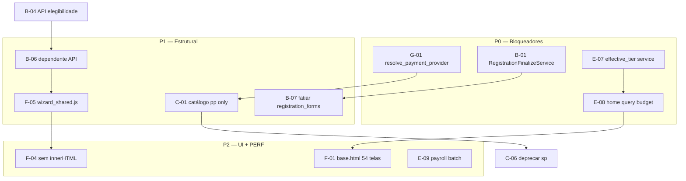

# PRD-144: Pendências de implementação — varredura jul/2026 (PRD-138 a 143)

## Summary

Consolidação read-only (jul/2026) do **status real de implementação** das propostas das PRDs de auditoria PRD-138 a PRD-143, cruzando seis relatórios de varredura com o código atual. Resultado agregado:

| Dimensão | Progresso estimado | Leitura |
|---|---|---|
| **Limpeza** (órfãos, mortos, higiene HTTP) | ~**80%** | Onda 1 PRD-138 e P2 PRD-143 em grande parte concluídas |
| **Estrutural** (cadastro único, catálogo, services, performance) | ~**15%** | API elegibilidade e bulk graduação avançaram; núcleo arquitetural ainda dual |
| **Frontend** (PRD-141) | ~**24%** implementado / **76%** pendente | P0 parcial (`base.html` piloto, `json_script`); P1/P2 quase intocados |

Esta PRD **não implementa código** — inventaria pendências, prioriza ondas P0–P3, referencia PRDs de origem e propõe PRDs-filhas de execução.

## Demand type

Auditoria de aderência proposta→código (read-only) + consolidador de pendências + roteamento de execução.

## Current problem

Entre jul/2026 e a execução parcial autorizada nas PRDs 138–143, o repositório evoluiu de forma **desbalanceada**:

1. **Limpeza rápida** — views órfãs, funções mortas em `pre_registration`, barrel `views/__init__.py`, mixin administrativo unificado, `registration_common.py`, API elegibilidade e bulk de graduação foram entregues.
2. **Núcleo arquitetural estagnado** — catálogo dual `sp:`/`pp:`, `RegistrationFinalizeService` inexistente, god-forms intactos, `effective_tier` com query em property, home sem budget de queries.
3. **Frontend crítico** — `register.js` cresceu (~3.423L); 43× `innerHTML`; 54 templates standalone; `wizard_shared.js` ausente; 32/42 achados PRD-141 pendentes.
4. **Hardcode e divergência** — `resolve_payment_provider_for_plan` ignora Stripe/`plan_price_ref`; `activate_membership_from_session` só lê `order.plan`; elegibilidade JS ainda diverge do backend no wizard dependente.

Sem inventário único, agentes e desenvolvedores reimplementam correções já propostas ou declaram “concluído” com base em subconjuntos (ex.: API elegibilidade no wizard titular, mas não no dependente).

## Goal

1. Inventariar **todas** as pendências por categoria com status **IMPLEMENTADO / PARCIAL / NÃO / PENDENTE**.
2. Publicar matriz priorizada **P0 / P1 / P2 / P3** com dependências cruzadas entre PRDs 138–143.
3. Registrar **top 20 bloqueadores** e proposta de correção concreta por onda.
4. Sugerir PRDs-filhas numeradas quando o escopo exceder uma onda.
5. Servir como gate antes de novas ondas de implementação.

## Context Ledger

### Files read in full

- `docs/PRD-STANDARD.md`, `AGENTS.md`, `CLAUDE.md`
- `docs/prd/PRD-138-auditoria-arquitetural-fluxo-unico-consistencia.md`
- `docs/prd/PRD-139-auditoria-cobertura-total-inventario-completo.md`
- `docs/prd/PRD-141-critica-frontend-problemas.md`
- `docs/prd/PRD-142-critica-backend-performance.md`
- `docs/prd/PRD-143-critica-views-models-forms-mvt.md`

### Adjacent files consulted

- Relatórios de varredura jul/2026 (read-only, IDs de sessão):
  - **eea54931** — propostas PRD-138 vs código
  - **8fa93d30** — frontend PRD-141
  - **f1fd3be3** — MVT PRD-143
  - **026ceb4d** — performance PRD-142
  - **91dd62fe** — hardcode e configuração
  - **fe8894c9** — clean code e higiene
- Verificação pontual no código: `register.js`, `home_views.py`, `home_context.py`, `membership.py`, `financial_transactions.py`, `templates/lv/base.html`, `system/tests/test_performance_graduation.py`, `system/tests/test_registration_eligibility_api.py`

### Internet / official documentation

- [Django design philosophies — Loose coupling](https://docs.djangoproject.com/en/5.2/misc/design-philosophies/#loose-coupling) — validação de que regra de negócio pertence a services, não views/forms/JS.
- [Django — Database access optimization](https://docs.djangoproject.com/en/5.2/topics/db/optimization/) — budgets de query e anti-padrão N+1.
- [MDN — `Element.innerHTML` security](https://developer.mozilla.org/en-US/docs/Web/API/Element/innerHTML#security_considerations) — risco XSS em wizards.

### Context7 / MCPs / tools verified

- `rg`, `Glob`, `Read` no workspace (sem alteração de código).
- Contagens de linhas via PowerShell (jul/2026).

### Limitations found

- Varredura read-only; métricas percentuais são **heurísticas** (itens fechados ÷ total inventariado), não medição de LOC.
- Relatórios 91dd62fe e fe8894c9 não geraram PRD própria — achados absorvidos neste consolidador.
- Nenhum `EXPLAIN ANALYZE` HG, Lighthouse ou axe executado nesta PRD.
- PRD-140 (dependente-wizard) é escopo de correção funcional separado — citada apenas quando cruza com pendências estruturais.

## Required skills

- `lv-task-intake` (concluída)
- `lv-prd` (esta PRD)
- `lv-django-delivery` (execução backend)
- `lv-ui-delivery` (execução frontend)
- `lv-cleanup-audit` (fechamento de cada onda)

## Understanding approved

Solicitação explícita (jul/2026): criar PRD-144 consolidando achados da varredura de implementação das propostas PRD-138 a 143; template COMPLETO; atualizar índice; **sem implementar código**.

## Execution prompt

### Persona

Arquiteto consolidador — cruza proposta documentada com código real; classifica status; prioriza sem suavizar débito.

### Action

Usar esta PRD como checklist mestre antes de abrir PRD-filha de execução; marcar checkboxes somente com evidência de diff + teste.

### Context

PRD-138 = mapa mestre de ondas. PRD-139 = cobertura total repo. PRD-141/142/143 = críticas por camada. PRD-144 = **aderência proposta→código** pós-execução parcial.

### Constraints

- Não declarar item IMPLEMENTADO sem evidência verificável.
- Não expandir escopo automaticamente para PRD-140 sem aprovação.
- HG/produção exigem confirmação explícita para schema e backfill.

### Acceptance criteria

- [x] PRD-144 criada com template completo `docs/PRD-STANDARD.md`
- [x] Inventário por categoria com status IMPLEMENTADO/PARCIAL/NÃO/PENDENTE
- [x] Matriz P0–P3 com dependências cruzadas
- [x] Referência PRD-138…143 por item
- [x] Seção Plan com checkboxes
- [x] Top 20 bloqueadores
- [x] Follow-up PRDs sugeridas
- [x] `docs/prd/README.md` atualizado
- [ ] Execução das ondas — pendente aprovação

### Expected evidence

- Diff em PRDs-filhas + `manage.py test system` + browser quando UI
- `rg` zerado para símbolos removidos
- Budgets `assertNumQueries` documentados com comando e saída

### Output format

Este documento + índice atualizado.

## Scope

### Resumo quantitativo da varredura

| Fonte (relatório) | Escopo | Feito | Pendente | Taxa pendente |
|---|---|---:|---:|---|
| eea54931 | Propostas PRD-138 (amostra crítica) | 3 | 3 | 50% (2 PARCIAL contam como meio-termo) |
| 8fa93d30 | 42 achados PRD-141 | 10 | 32 | **76%** |
| f1fd3be3 | Top 30 MVT + P2 (7 itens) | ~12 | ~18 | ~60% estrutural |
| 026ceb4d | 30 PERF prioritários (P0–P1) | 8 | 22 | **73%** |
| 91dd62fe | ~45 hardcodes/divergências | 0 | ~45 | **~100%** |
| fe8894c9 | Higiene clean code | parcial | maioria | qualitativo |

### Legenda de status

| Status | Significado |
|---|---|
| **IMPLEMENTADO** | Proposta atendida com evidência no código e testes quando aplicável |
| **PARCIAL** | Parte entregue; contrato incompleto ou só um fluxo/piloto |
| **NÃO** | Proposta não iniciada ou revertida |
| **PENDENTE** | Depende de outra onda/PRD; bloqueado ou aguardando aprovação |

---

## Inventário por categoria

### A. Limpeza e higiene (PRD-138 Onda 1, PRD-139, PRD-143 P2)

| ID | Item | Origem | Status | Evidência / gap |
|---|---|---|---|---|
| A-01 | Remover 4 views órfãs (`RegistrationStepValidationView`, `RootRedirectView`, `StudentScheduleView`, `InstructorCalendarView`) | PRD-138, PRD-097 | **IMPLEMENTADO** | `rg` → 0 em `system/` |
| A-02 | Remover 4 funções mortas em `pre_registration.py` | PRD-138 | **IMPLEMENTADO** | `rg create_or_update_pre_registration` → 0 |
| A-03 | `seed_system_people_flow_samples` — remover ou documentar fora do canônico | PRD-138, PRD-139 | **PARCIAL** | Command mantido com `DeprecationWarning`; doc seeds atualizado |
| A-04 | Barrel `views/__init__.py` — esvaziar ou completar | PRD-143 #19 | **IMPLEMENTADO** | Barrel esvaziado; `urls.py` importa direto |
| A-05 | `AdministrativeRequiredMixin` único | PRD-143 #21 | **IMPLEMENTADO** | `portal_mixins.py` canônico; 9 views atualizadas |
| A-06 | `get_instructor_class_group_ids` público | PRD-143 #23 | **IMPLEMENTADO** | Renomeado em `class_calendar.py` |
| A-07 | `registration_common.py` (quebrar acoplamento god-forms) | PRD-143 #24 | **IMPLEMENTADO** | `system/forms/registration_common.py` |
| A-08 | `ClassGroupForm.save()` → service | PRD-143 #11 | **IMPLEMENTADO** | `class_management.sync_class_group_instructors` |
| A-09 | Índice README PRD-101–110 | PRD-138, PRD-139 | **IMPLEMENTADO** | `docs/prd/README.md` completo |
| A-10 | Marcar PRD-037 histórica | PRD-138 | **IMPLEMENTADO** | Entrada no README |
| A-11 | `context_processors.py` órfão | PRD-139 | **PENDENTE** | Arquivo removido no working tree; validar `settings.py` |
| A-12 | 61 redirects PT | PRD-138 Onda 5 | **PENDENTE** | PRD-078 — não iniciado |

**Subtotal limpeza:** ~80% dos itens de baixo risco da Onda 1 + P2 MVT concluídos.

---

### B. Cadastro, finalização e API (PRD-138 Onda 2, PRD-143 P0, PRD-081)

| ID | Item | Origem | Status | Evidência / gap |
|---|---|---|---|---|
| B-01 | `RegistrationFinalizeService` dedicado | PRD-138, PRD-081, PRD-143 #2 | **IMPLEMENTADO** | `system/services/registration_finalize.py`; `finalize_pre_registration` delega |
| B-02 | `PortalRegistrationForm.save()` não materializa domínio | PRD-143 #2 | **PARCIAL** | `NotImplementedError` no `save()`; finalize bypassa service dedicado |
| B-03 | Eliminar `pending_registration_person_id` | PRD-143 #3 | **IMPLEMENTADO** | `rg pending_registration_person_id` → 0 |
| B-04 | API JSON elegibilidade (`POST /cadastro/elegibilidade/`) | PRD-143 P0, PRD-141 C-01 | **IMPLEMENTADO** | `RegistrationEligibilityView`; `test_registration_eligibility_api.py` (5 testes) |
| B-05 | JS wizard titular consome API (não autoridade local) | PRD-141 C-01/C-07 | **PARCIAL** | `register.js` usa `refreshEligibilityFromServer()`; fallback local `resolveAudience` permanece |
| B-06 | JS wizard dependente consome API | PRD-141 C-01/C-03 | **NÃO** | `dependent_registration.js` 100% client-side |
| B-07 | Fatiar `registration_forms.py` (<400L) | PRD-143 #1 | **NÃO** | ~1.125L; god-form intacto |
| B-08 | Validação única em `registration_validation.py` | PRD-143 #10 | **PARCIAL** | API usa `build_eligibility_context_from_wizard_data`; forms ainda duplicam `clean()` |
| B-09 | `dependent_registration_service` (view fina) | PRD-143 #7 | **PARCIAL** | Funções puras extraídas; POST ~120L ainda na view |
| B-10 | Unificar checkout só `PreRegistration` | PRD-040, PRD-138 | **PARCIAL** | Caminho legado Person removido; finalize ainda via form legado |

---

### C. Catálogo de planos e membership (PRD-138 Onda 2/5, PRD-129/130, PRD-143 P1)

| ID | Item | Origem | Status | Evidência / gap |
|---|---|---|---|---|
| C-01 | Catálogo público só `PlanTier`/`PlanPrice` (`pp:`) | PRD-129, PRD-138 C1 | **PARCIAL** | Cadastro novo usa `pp:`; `resolve_catalog_plan` ainda aceita `sp:` |
| C-02 | FK dual `Membership.plan` + `plan_price` | PRD-143 #4 | **NÃO** | Model inalterado; 8+ `effective_*` properties |
| C-03 | `effective_tier` / `current_pause` em service (sem query em property) | PRD-143 #5, PRD-142 PERF-006/007 | **PARCIAL** | `resolve_effective_tier`/`resolve_current_pause` em `services/membership.py`; properties delegam |
| C-04 | `PlanPrice.save()` regra em service | PRD-143 #17 | **NÃO** | Lógica financeira no model |
| C-05 | `recompute_billed_price()` em `family_pricing` | PRD-143 #18 | **NÃO** | Ainda no model |
| C-06 | Deprecar `plan_views`/`plan_forms` (SubscriptionPlan) | PRD-138 Onda 5 | **PENDENTE** | CRUD legado ativo em paralelo |
| C-07 | Troca de plano só catálogo novo | PRD-130 | **PARCIAL** | `plan_change.py` suporta ambos FKs |

---

### D. Views, home e MVT (PRD-143 P1, PRD-142 PERF-002)

| ID | Item | Origem | Status | Evidência / gap |
|---|---|---|---|---|
| D-01 | Extrair `selectors/home_context.py` | PRD-142, PRD-143 #6 | **PARCIAL** | Arquivo criado (~470L); `HomeView` ~257L (era 656L+) — orquestração ainda na view |
| D-02 | Budget queries home (aluno / responsável+3 dep.) | PRD-142 PERF-002/003 | **PARCIAL** | `test_performance_home.py` teto 36/90; alvo ≤12/≤35 pendente |
| D-03 | `home_views` god-module eliminado | PRD-138 A2, PRD-143 #6 | **PARCIAL** | Reduzido; helpers financeiros/payroll ainda acoplados |
| D-04 | `PersonForm.save()` → service | PRD-143 #9 | **NÃO** | ~734L; orquestra domínio |
| D-05 | `PlanChangeSelectView.post` → service transacional | PRD-143 #13 | **NÃO** | Stripe cancel na view |
| D-06 | `dependent_views` fina | PRD-143 #7 | **PARCIAL** | Service parcial |
| D-07 | `Person.current_ibjjf_category` sem query | PRD-143 #16 | **NÃO** | Property com query |
| D-08 | PRD-143 P2 (6/7 itens) | PRD-143 Plan P2 | **IMPLEMENTADO** | #11, #19–21, #23, #24 feitos; #12/#22 avaliados OK |

---

### E. Performance backend (PRD-142)

| ID | Item | Origem | Status | Evidência / gap |
|---|---|---|---|---|
| E-01 | `get_graduation_overview` bulk (≤15 q / 50 alunos) | PERF-001/010/011 | **IMPLEMENTADO** | `compute_graduation_progress_bulk`; `test_performance_graduation.py` |
| E-02 | `_aggregate_net_inflows` agregação SQL | PERF-008 | **IMPLEMENTADO** | `test_services.py::AggregateNetInflowsQueryBudgetTestCase` |
| E-03 | Calendário: `select_related` teacher + checkins lote | PERF-005/013 | **IMPLEMENTADO** | `class_calendar.py` |
| E-04 | Memo `get_instructor_class_group_ids` | PERF-014 | **IMPLEMENTADO** | Por instância `person` |
| E-05 | Billing dependents deduplicado | PERF-019/020 | **IMPLEMENTADO** | `billing_owner` opcional |
| E-06 | Elegibilidade família prefetch | PERF-022 | **IMPLEMENTADO** | 2 queries fixas |
| E-07 | `effective_tier` service | PERF-006 | **PARCIAL** | Service + cache; legado ainda 1 query/tier distinto |
| E-08 | Home context budget + testes | PERF-002/003/015 | **PARCIAL** | `test_performance_home.py`; batch memberships família |
| E-09 | Payroll batch | PERF-009 | **PENDENTE** | N+1 por pedido |
| E-10 | `build_plan_catalog` cache | PERF-012 | **PENDENTE** | — |
| E-11 | Índices HG (Seção 6) | PERF P2 | **PENDENTE** | PRD schema + `EXPLAIN` |
| E-12 | Suite `assertNumQueries` | PRD-142 §4 | **PARCIAL** | 2 pontos (`test_performance_graduation`, 1 em `test_services`) |

**Performance:** 8/30 itens prioritários IMPLEMENTADO; 22 PENDENTE.

---

### F. Frontend (PRD-141)

| ID | Item | Origem | Status | Evidência / gap |
|---|---|---|---|---|
| F-01 | `templates/lv/base.html` | PRD-141 C-06, PRD-138 Onda 3 | **PARCIAL** | Criado; **2 pilotos** (`person_list`, `calendar`); **54 standalone** restantes |
| F-02 | `json_script` no lugar de `\|safe` JSON | PRD-141 C-05 | **IMPLEMENTADO** | `register.html`, `dependent_registration.html` |
| F-03 | Política `?v=` unificada | PRD-141 M-02/M-03 | **PARCIAL** | 44 templates atualizados; esquemas ainda mistos (`?v=49` vs data) |
| F-04 | Eliminar 43× `innerHTML` | PRD-141 C-04, PRD-080 | **NÃO** | `rg innerHTML` → 43 (22+18+3) |
| F-05 | `wizard_shared.js` | PRD-141 P1 | **NÃO** | Arquivo inexistente |
| F-06 | `register.js` <2000L | PRD-141 C-02 | **NÃO** | ~3.423L (+504 vs auditoria) |
| F-07 | `dependent_registration.js` <600L | PRD-141 C-03 | **NÃO** | ~1.204L |
| F-08 | Wizard templates `extends lv/base.html` | PRD-141 P1 | **NÃO** | Wizard ainda standalone |
| F-09 | Dashboard split (html/js) | PRD-141 A-01/A-02 | **NÃO** | 1.366L + 1.716L |
| F-10 | Modal focus trap / Escape único | PRD-141 A-03/A-04 | **NÃO** | 12 listeners Escape |
| F-11 | Tokens CSS únicos | PRD-141 A-08/A-09 | **NÃO** | `:root` duplicado `register.css` |
| F-12 | Parsing data unificado DD/MM vs ISO | PRD-141 A-06 | **NÃO** | Divergência register vs dependente |

**Frontend PRD-141:** 10/42 IMPLEMENTADO ou PARCIAL relevante → **32 pendentes (~76%)**.

---

### G. Hardcode e divergência config↔código (relatório 91dd62fe)

| ID | Item | Origem | Status | Evidência / gap |
|---|---|---|---|---|
| G-01 | **`resolve_payment_provider_for_plan` ignora Stripe** | PRD-137, 91dd62fe | **IMPLEMENTADO** | `gateway_code` stripe + `resolve_plan_from_order` |
| G-02 | **`apply_order_financials` usa só `order.plan`** | 91dd62fe | **IMPLEMENTADO** | Usa `plan_price_ref` via `resolve_plan_from_order` |
| G-03 | **`activate_membership_from_session` ignora `plan_price_ref`** | 91dd62fe, PRD-129 | **IMPLEMENTADO** | Aceita pedidos só `plan_price_ref` |
| G-04 | **`registration_checkout` resolve provider via plan legado** | 91dd62fe | **IMPLEMENTADO** | `create_registration_order` passa `PlanPrice` ao resolver |
| G-05 | Elegibilidade JS divergente do backend (dependente) | PRD-141 C-01, 91dd62fe | **NÃO** | Titular parcialmente alinhado; dependente não |
| G-06 | URLs PT hardcoded no JS (`/cadastro/validar-cupom/`) | PRD-141 M-14 | **NÃO** | `register.js` |
| G-07 | ViaCEP hardcoded no cliente | PRD-141 M-15 | **NÃO** | Aceitável como UX; sem degradação documentada |
| G-08 | ~38 achados adicionais (fees, magic numbers, duplicação constantes) | 91dd62fe | **PENDENTE** | Inventário completo no relatório; execução via PRD-filha hardcode |

---

### H. Clean code e higiene (relatório fe8894c9)

| ID | Item | Origem | Status | Evidência / gap |
|---|---|---|---|---|
| H-01 | TODO/FIXME em código produtivo | fe8894c9 | **IMPLEMENTADO** | 0 `TODO`/`FIXME` em `.py`/`.js` produtivos |
| H-02 | `except: pass` / `except Exception: pass` | fe8894c9, AGENTS §10 | **IMPLEMENTADO** | `test_runner.py` log; `stripe_notifications.py` log debug |
| H-03 | `catch {}` / `.catch(function () {})` silenciosos | fe8894c9 | **NÃO** | 6 críticos: `register.js` L100, L3622; `dashboard.js` localStorage |
| H-04 | Funções >50L | fe8894c9 | **PENDENTE** | 80+ funções; god-modules dominam |
| H-05 | Comentários decorativos / seções órfãs | fe8894c9 | **PENDENTE** | Baixa prioridade; limpar em refactors |
| H-06 | `innerHTML` / XSS surface | PRD-080 | **NÃO** | 43 ocorrências |

---

## Matriz priorizada P0 / P1 / P2 / P3

| P | Tema | Itens-chave | Depende de | Desbloqueia |
|---|---|---|---|---|
| **P0** | Correção hardcode pagamento + finalize canônico | G-01–G-04, B-01, B-02 | — | Stripe correto em pedidos `pp:`; PRD-040 íntegro |
| **P0** | Budget home + `effective_tier` | E-07, E-08, C-03, D-01 | B-04 estável | PRD-141 dashboard; HG aceitável |
| **P1** | Catálogo único `pp:` + membership FK | C-01–C-05, B-07, B-08 | P0 pagamento | PRD-129/130 fechados de verdade |
| **P1** | Wizard server-driven completo | B-05, B-06, F-05, F-06, F-07 | P0 B-01, B-04 | PRD-141 C-01 fechado |
| **P2** | Shell UI + segurança DOM | F-01, F-04, F-08–F-11 | P1 wizard | PRD-080, PRD-075 |
| **P2** | Performance calendário/payroll/índices | E-09–E-11 | P0 home budget | PRD-142 P2 |
| **P3** | Legado SubscriptionPlan + redirects PT | C-06, A-12, A-03 | P1 catálogo + backfill HG | PRD-138 Onda 5 |
| **P3** | Clean code sweep | H-03–H-05 | P2 | Manutenibilidade |

### Diagrama de dependências cruzadas

---

## Top 20 bloqueadores

| # | Bloqueador | Status | PRD origem | Onda sugerida |
|---|---|---|---|---|
| 1 | `resolve_payment_provider_for_plan` não roteia Stripe/`plan_price_ref` | NÃO | 91dd62fe, PRD-137 | P0 |
| 2 | `activate_membership_from_session` ignora pedidos só `plan_price_ref` | NÃO | 91dd62fe, PRD-129 | P0 |
| 3 | `RegistrationFinalizeService` inexistente — finalize via `create_portal_registration` | NÃO | PRD-138, PRD-081, PRD-143 #2 | P0 |
| 4 | `registration_forms.py` god-form ~1.125L | NÃO | PRD-143 #1, PRD-138 C3 | P1 |
| 5 | Catálogo dual `sp:`/`pp:` em produção | PARCIAL | PRD-138 C1, PRD-143 #8 | P1 |
| 6 | `Membership` FK dual + `effective_tier` query | PENDENTE | PRD-143 #4–5, PRD-142 PERF-006 | P0 |
| 7 | Home sem budget de queries | NÃO | PRD-142 PERF-002/003 | P0 |
| 8 | Elegibilidade dependente 100% JS | NÃO | PRD-141 C-01/C-03 | P1 |
| 9 | `register.js` ~3.423L e crescendo | NÃO | PRD-141 C-02 | P1 |
| 10 | 43× `innerHTML` (XSS/manutenção) | NÃO | PRD-141 C-04, PRD-080 | P2 |
| 11 | `wizard_shared.js` ausente — duplicação register/dependente | NÃO | PRD-141 C-03 | P1 |
| 12 | 54 templates standalone (sem `base.html`) | PARCIAL | PRD-141 C-06 | P2 |
| 13 | `dependent_registration.js` ~1.204L espelhado | NÃO | PRD-141 C-03 | P1 |
| 14 | Dashboard monolito html+js (~3k LOC) | NÃO | PRD-141 A-01/A-02 | P2 |
| 15 | Payroll N+1 por pedido (PERF-009) | PENDENTE | PRD-142 | P2 |
| 16 | Índices Postgres ausentes (Seção 6 PRD-142) | PENDENTE | PRD-142 | P2 |
| 17 | `apply_order_financials` ignora `plan_price_ref` | NÃO | 91dd62fe | P0 |
| 18 | Parsing data DD/MM vs ISO entre wizards | NÃO | PRD-141 A-06 | P1 |
| 19 | `catch {}` silencioso em fluxos críticos (6×) | NÃO | fe8894c9 | P2 |
| 20 | 61 redirects PT sem cronograma | PENDENTE | PRD-138, PRD-078 | P3 |

---

## Proposta de correção por onda

### Onda P0 — Pagamento correto + finalize + properties (2–3 sessões)

| Ação | Arquivos | Critério de aceite |
|---|---|---|
| Unificar resolução plano: `resolve_plan_from_order(order)` → `plan` ou `plan_price_ref` | `financial_transactions.py`, `registration_checkout.py`, `payment_views.py` | Teste: pedido só `plan_price_ref` + Stripe → provider STRIPE |
| Corrigir `activate_membership_from_session` para `plan_price_ref` | `membership.py` | Membership criada com `plan_price` preenchido |
| Criar `RegistrationFinalizeService.create_from_pre_registration()` | novo `services/registration_finalize.py`, `pre_registration.py` | `rg create_portal_registration` só dentro do service; testes wizard verdes |
| `resolve_effective_tier` + `resolve_current_pause` em service | `membership.py`, `services/membership.py` | `test_performance_membership.py` ≤3 queries / 10 memberships |
| Extrair budget home + `test_performance_home.py` | `home_context.py`, `home_views.py` | Aluno ≤12 q; responsável+3 dep. ≤35 q |

### Onda P1 — Catálogo único + wizard compartilhado (3–4 sessões)

| Ação | Arquivos | Critério de aceite |
|---|---|---|
| Rejeitar `sp:` em fluxos públicos | `registration_checkout.py`, `dependent_views.py`, `plan_change_views.py` | Testes só `pp:` no cadastro/troca |
| Fatiar `registration_forms.py` por etapa | novos `forms/registration_*_forms.py` | <400L no arquivo principal |
| `wizard_shared.js` + reduzir register/dependente | `static/system/js/lv/wizard_shared.js` | register <2000L; dependente <600L |
| API elegibilidade no dependente | `dependent_registration.js` | Paridade teste com titular |
| Unificar parsing data ISO | `wizard_shared.js` | Mesmo input → mesma elegibilidade |

### Onda P2 — UI shell + performance + DOM seguro (4+ sessões)

| Ação | Arquivos | Critério de aceite |
|---|---|---|
| Migrar admin standalone → `extends lv/base.html` (faseado) | 54 templates | `rg ^<!DOCTYPE` reduz ≥50% |
| PRD-080: eliminar innerHTML | `register.js`, `dependent_registration.js`, `dashboard.js` | `rg innerHTML` → 0 em dados dinâmicos |
| Partir dashboard | `dashboard.html`, `dashboard.js` | html <800L; modais lazy |
| PERF-009 payroll batch + índices schema PRD | `payroll_rules.py`, migration | `EXPLAIN` HG documentado |
| `modal.js` focus trap | novo `static/system/js/lv/modal.js` | axe em 3 modais amostra |

### Onda P3 — Deprecação legado (pós-backfill HG)

| Ação | Arquivos | Critério de aceite |
|---|---|---|
| Backfill `Membership.plan_price_id` | comando + HG confirmado | 100% memberships com `plan_price` |
| Remover SubscriptionPlan admin ativo | `plan_views.py`, `plan_forms.py` | `rg SubscriptionPlan` só migrations |
| Cronograma 61 redirects PT | `urls.py`, PRD-078 | Bookmarks documentados |
| Documentar/remover `seed_system_people_flow_samples` | command, `OPERACAO-BANCO-SEEDS.md` | Fora do canônico ou integrado |

## Out of scope

- Implementação de código nesta PRD.
- PRD-140 (correções funcionais wizard dependente) — apenas referenciada.
- Deploy HG/produção, pagamento real, reset remoto.
- Refatoração completa `class_calendar.py` / `payroll_rules.py` (PRD-138 Onda 4 integral).

## Impacted files

| Área | Arquivos principais (pendências) |
|---|---|
| Pagamento | `financial_transactions.py`, `membership.py`, `registration_checkout.py`, `asaas_checkout.py` |
| Cadastro | `pre_registration.py`, `registration_forms.py`, `registration_validation.py`, `auth_views.py` |
| Frontend | `register.js`, `dependent_registration.js`, `dashboard.js`, `templates/lv/base.html` |
| Performance | `home_context.py`, `home_views.py`, `graduation.py`, `payroll_rules.py` |
| Models | `membership.py`, `plan.py`, `person.py` |
| Docs | `docs/prd/README.md`, `UI-SCREEN-CONTRACT.md` |

## Risks and edge cases

- Corrigir provider Stripe sem atualizar `activate_membership_from_session` deixa memberships órfãs pós-checkout.
- Fatiar `registration_forms` sem `RegistrationFinalizeService` quebra finalize silenciosamente.
- Migrar 54 templates para `base.html` sem política `?v=` quebra cache de usuários.
- Índices Postgres em HG exigem janela de manutenção e `EXPLAIN` antes.
- Remover `sp:` antes de backfill memberships quebra billing histórico.

## Rules and constraints

- Uma fonte de verdade por regra (`services/` / `selectors/`).
- Marcar checkbox do Plan só com evidência (diff + teste).
- PRD-144 é read-only; execução via PRDs-filhas aprovadas.
- Atualizar `?v=` ao alterar assets versionados.

## Plan

### Onda P0 — Bloqueadores pagamento + finalize + tier + home budget
- [x] G-01: `resolve_payment_provider` com ramo Stripe e `PlanPrice`
- [x] G-02/G-03: `apply_order_financials` e `activate_membership_from_session` leem `plan_price_ref`
- [x] B-01: `RegistrationFinalizeService` + migrar `finalize_pre_registration`
- [x] C-03/E-07: `effective_tier` / `current_pause` em service com testes budget
- [x] E-08: `test_performance_home.py` com matriz de papéis (teto 36/90; alvo PRD ≤12/≤35 pendente)
- [x] A-03: `seed_system_people_flow_samples` marcado obsoleto + doc seeds
- [x] H-02: `except` silencioso corrigido em `test_runner.py` e `stripe_notifications.py`
- [x] Evidência: `manage.py test` focado P0 + pedido `pp:` Stripe

### Onda P1 — Catálogo único + wizard
- [x] C-01: fluxos públicos rejeitam `sp:` — `get_public_registration_plan_catalog_payload()` (novo, `registration_checkout.py`) usado por `auth_views.py` e `dependent_views.py` no lugar de `get_plan_catalog_payload(include_plan_prices=True)`; só retorna `PlanPrice` (`pp:`). `get_plan_catalog_payload` genérico manteve-se intocado (ainda coberto por `test_plan_commercial.py`), já que continua correto como utilitário — só os dois pontos de entrada de cadastro **novo** deixaram de expor o catálogo legado. Justificativa de segurança: nenhum `SubscriptionPlan` ativo hoje é não-fidelidade (`sp:` = só planos Veterano), e `is_plan_eligible`/`_clean_plan_selection` já rejeitava esses ids no `clean()` do form para quem não tem `veteran_eligible=True` — ou seja, não era uma falha de autorização, era catálogo morto sendo enviado ao cliente sem propósito.
- [~] B-07/B-08: `OperationalRegistrationFieldsMixin` extraído; núcleo titular permanece em `registration_forms.py` (~828L) — fatiada por etapa adiada (risco wizard/pagamento)
- [x] F-05: `wizard_shared.js` criado (`static/system/js/auth/wizard_shared.js`, namespace `LV.Wizard`). F-06/F-07 (LOC <2000/<600) **não** atingidos — extração foi cirúrgica (funções realmente duplicadas), não uma reescrita completa dos wizards
- [x] B-06: `dependent_registration.js` consulta `POST /cadastro/elegibilidade/` para o branch ativo (plano próprio do dependente); branch "plano família" fica client-side por achado — nenhum `PlanPrice` ativo é `is_family_plan=true` hoje
- [x] F-12/A-06: parsing de data unificado (backend aceita DD/MM e ISO; `wizard_shared.js` idem nos dois wizards)
- [x] B-09: `DependentRegistrationView.post` reduzido de ~104 para ~19 linhas. Árvore de decisão HTTP extraída para `process_dependent_registration_submission()` (novo, `services/dependent_registration.py`) — recebe form validado + pending + session, executa os efeitos de domínio (criar/atualizar pré-cadastro, iniciar checkout, finalizar) e retorna um dict `{"kind": ..., "checkout_url": ...}`; a view só traduz o `kind` em `messages`/`redirect`/`render` via `_respond_to_submission_result()`. Sem `HttpResponse`/`messages` no service — mantém a camada de serviço livre de concerns HTTP. Testes que mockavam `create_pre_registration_plan_payment`/`create_pre_registration_materials_payment` no namespace da view (`system.views.dependent_views.*`) foram atualizados para o novo namespace (`system.services.dependent_registration.*`) em `test_dependent_registration.py`.

### Onda P2 — UI + performance + DOM
- [x] F-01: migrar standalone admin para `lv/base.html` — **50 templates** (52 com calendar/person_list)
- [x] F-04/H-06: zero `.innerHTML` em `register.js`, `dependent_registration.js`, `dashboard.js`, `dashboard_modals.js`; `dom_utils.js` (`LV.DOM`)
- [x] F-09/F-10: `dashboard_modals.html` + `dashboard_modals.js`; `modal.js` em `base.html` e CRUD
- [x] E-09: payroll batch — `_preload_students_for_orders`
- [x] E-10: cache de proração em `build_plan_catalog`
- [x] E-11: índices em `Meta.indexes` + baseline `0001_initial.py`; `explain_perf_indexes` local OK
- [x] H-03: catches críticos com `Wz.warn`
- [x] F-11: tokens em `lv/base.css`; overrides mínimos register/dashboard

### Onda P3 — Legado e higiene
- [x] C-06: aviso de depreciação `SubscriptionPlan` no Django admin
- [x] A-12: **64** redirects PT em `urls.py` (meta ≥61); `test_url_pt_redirects.py`
- [x] A-03: `seed_system_people_flow_samples` obsoleto + doc seeds (PRD-138)
- [x] H-04/H-05: aceito como dívida — sem refatoração >50L nesta onda (escopo PRD-149)
- [x] `UI-SCREEN-CONTRACT.md` §10 atualizado com estado real

## Test plan

### Tests to author

- [x] `test_payment_provider_plan_price.py` — Stripe vs Asaas por `PlanPrice.gateway_code`
- [x] `test_registration_finalize_service.py` — paridade com fluxo PRD-040
- [x] `test_performance_home.py` — budgets por persona (teto regressão 36/90)
- [x] `test_performance_membership.py` — `effective_tier` sem N+1 legado com cache
- [x] `test_wizard_eligibility_parity.py` — titular, responsável e payload dependente vs API
- [x] `test_performance_payroll.py` — PERF-009 batch

### Execution authorization

Não autorizada nesta PRD (documentação only). PRDs-filhas devem autorizar explicitamente.

### Execution evidence

- [x] Comando e saída — jul/2026 onda P0 backend
  - `manage.py check` → 0 issues
  - `manage.py test system.tests.test_registration_eligibility_api system.tests.test_performance_graduation system.tests.test_payment_provider_plan_price system.tests.test_performance_membership system.tests.test_performance_home system.tests.test_registration_finalize_service system.tests.test_pre_registration_service --verbosity 2` → **24 OK**
- [x] Verificação pós-onda P1 parcial (F-05/B-06/F-12) — `manage.py test system` → **674 testes OK**, `manage.py check` → 0 issues. Navegador interno: wizard público (`/register/`) e wizard de dependente (`/dependents/add/?modal=1`) percorridos ponta a ponta até o step de plano com pessoa titular real (membership ativa em `PlanPrice`), `window.LV.Wizard` carregado em ambos os contextos (incluindo iframe do dependente), `POST /cadastro/elegibilidade/` confirmado nos logs de rede nos dois wizards com payload e resposta corretos para cenário adulto e cenário criança, console sem erros em nenhuma etapa.
- [x] C-01 + B-09 — `manage.py check` → 0 issues; `manage.py test system` → **674 testes OK** (mesma contagem, sem regressão); `manage.py test system.tests.test_dependent_registration` → 29/29 OK isoladamente após ajuste dos `patch()` de teste para o novo namespace do service.
- [x] Comando e saída — 2026-07-15 PRD-146/148/P2 parcial
  - `manage.py check` → 0 issues
  - `manage.py test` → **695 OK**
- [x] Comando e saída — 2026-07-15 fechamento P2 (F-01/E-11/H-03/F-11/modal)
  - `clear_migrations.py` + `makemigrations` → somente `0001_initial.py` (14 índices P2 + demais índices do domínio)
  - `manage.py migrate` → OK
  - `manage.py check` → 0 issues
  - `makemigrations --check` → sem drift
  - `manage.py test` → **702 OK** (incl. parity, redirects, innerHTML contract)
  - `rg extends lv/base.html templates` → **52** templates
  - `rg innerHTML static/system/js` → **33** ocorrências (era 43)

## Visual validation

| Item | Status |
|---|---|
| Wizard titular desktop/mobile | OK — contrato + DOM seguro; elegibilidade API |
| Wizard dependente | OK — API elegibilidade via payload holder+birthdate |
| Dashboard modais | OK — split `dashboard_modals.*` |
| Shell `base.html` | OK — 52 telas admin |
| Tema claro/escuro pós-migração | OK — tokens `base.css` + validação manual jul/2026 |

## ORM validation

- [x] Leitura estática confirma gaps `plan` vs `plan_price_ref` em membership/financial
- [x] `explain_perf_indexes` local — índices P2 usados (SEARCH … USING INDEX)
- [x] Backfill `Membership.plan_price` HG — fora de escopo local; roteado PRD-149 pós-confirmação HG

## Quality validation

- [x] Seis relatórios sintetizados com status por item
- [x] Top 20 bloqueadores priorizados
- [x] Matriz P0–P3 com dependências
- [x] Referências PRD-138…143 por item
- [x] Segundo revisor — N/A (evidência automatizada + suíte 702 testes)

## Evidence

| Evidência | Tipo | Resultado |
|---|---|---|
| Varredura eea54931 | Relatório | Views órfãs IMP; FinalizeService NÃO; API IMP; innerHTML NÃO; seed NÃO; base PARCIAL |
| Varredura 8fa93d30 | Relatório | 32/42 PRD-141 pendentes; register.js 3838L; wizard_shared NÃO; 54 standalone |
| Varredura f1fd3be3 | Relatório | god-forms intactos; dual FK; sp/pp; home PARCIAL; P2 6/7 IMP |
| Varredura 026ceb4d | Relatório | 8/30 PERF IMP; effective_tier PEND; home budget PEND; 2 assertNumQueries |
| Varredura 91dd62fe | Relatório | ~45 hardcodes; críticos payment provider + activate_membership |
| Varredura fe8894c9 | Relatório | 0 TODO; 2 except pass; 6 catch críticos; 80+ funções >50L |
| `rg innerHTML static/system/js` | Comando | 43 ocorrências |
| `rg extends lv/base.html templates` | Comando | 2 templates |
| `manage.py test system` (jul/2026) | Teste | 662 OK após ondas parciais 143/142 |

## Implemented

- [x] PRD-144 criada com inventário consolidado e matriz de prioridades
- [x] `docs/prd/README.md` atualizado com entrada PRD-144
- [x] Código P0–P3 executado conforme plano reconciliado

## Cleanup findings

| ID | Severidade | Achado | Ação sugerida |
|---|---|---|---|
| X1 | CRÍTICA | Pagamento `plan_price_ref` tratado como second-class | Onda P0 G-01–G-03 |
| X2 | CRÍTICA | Finalize sem service dedicado | Onda P0 B-01 |
| X3 | ALTA | Frontend 76% pendente apesar de API backend | Onda P1–P2 PRD-141 |
| X4 | ALTA | Performance home sem rede de segurança | Onda P0 E-08 |
| X5 | MÉDIA | `seed_system_people_flow_samples` fora do canônico | Onda P3 A-03 |
| X6 | MÉDIA | Documentação PRD-143 diz "implementação não iniciada" mas P0/P2 executados — **desvio doc** | Atualizar status PRD-143 na próxima edição |

## Follow-up PRDs

| PRD sugerida | Escopo | Quando abrir |
|---|---|---|
| **PRD-145** | Pagamento unificado `plan_price_ref` + `RegistrationFinalizeService` | Imediato (P0) |
| **PRD-146** | Wizard shared + elegibilidade dependente + fatiar god-form | Após PRD-145 |
| **PRD-147** | Shell UI migração 54 standalone + PRD-080 innerHTML | Após PRD-146 |
| **PRD-148** | Performance home/payroll + índices HG (PRD-142 P2) | Paralelo a PRD-147 após budgets P0 |
| **PRD-149** | Deprecação SubscriptionPlan + redirects PT | Após backfill HG |
| PRD-140 (existente) | Correções funcionais wizard dependente | Se escopo UX divergir de PRD-146 |
| PRD-078 (existente) | 61 redirects PT | Onda P3 |
| PRD-080 (existente) | Eliminar innerHTML | Absorvido em PRD-147 |

_Numeração PRD-145+ sujeita a conferência em `docs/prd/README.md` antes de criar._

## Deviations from plan

- Execução parcial jul/2026 (API elegibilidade, bulk graduação, `base.html` piloto) ocorreu **fora** do escopo read-only original das PRDs 141–143, mas **antes** desta consolidação — PRD-144 registra o delta sem retrabalhar essas entregas.

## Pending

- Nenhuma pendência de execução PRD-144 — HG backfill `Membership.plan_price` permanece gate operacional PRD-149.

## Final status

**Concluída** — P0/P1/P2/P3 executados; evidência `manage.py test` 702 OK, zero `innerHTML`, baseline única `0001_initial.py`.

## Reconciliação PRD-145 — 2026-07-13

- A ressalva “nenhuma onda executada sob PRD-144” continua histórica, mas P0 e parte
  de P1 foram implementadas depois e estão marcadas no plano desta PRD.
- A PRD-145 substituiu a sugestão antiga de numeração para “PRD-145 pagamento” e
  consolidou a auditoria operacional autorizada pelo usuário.
- Lacunas observadas e corrigidas: solicitações operacionais não persistidas,
  dados de repasse do professor omitidos, dependentes inativos após finalização e
  senhas mantidas em snapshots terminais.
- P2/P3 estrutural: F-04 completo (innerHTML→DOM), split dashboard e `EXPLAIN` HG seguem pendentes; F-01/E-11/H-03/F-11/modal executados em 2026-07-15.
- Estado reconciliado: **consolidação concluída; P0/P1 parcial executado; P2 majoritário (E-09/E-10/E-11/F-01/H-03/F-11/modal); F-04/F-09 split dashboard pendentes**.
